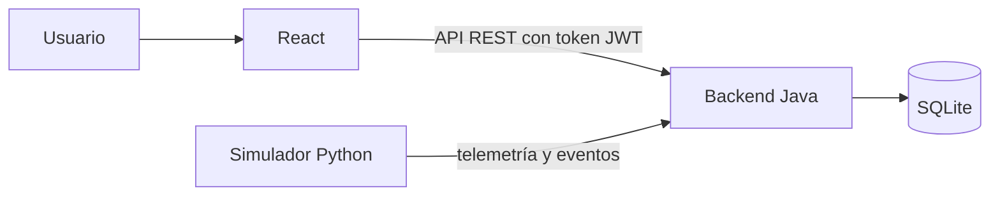

# NOVA TECH – Sistema de Monitoreo y Vigilancia para Obras

Proyecto académico del Grupo 4 (CIBERTEC). Este proyecto es independiente del que ocupa la raíz del repositorio y vive completo dentro de esta carpeta.

## Proyecto

NOVA TECH es una plataforma web para un centro de monitoreo que vigila obras de construcción a distancia. Cada obra tiene una estación autónoma con cámaras de seguridad, un panel solar, un banco de baterías, una antena Starlink como conexión principal y un módem 4G de respaldo.

Desde el navegador, el personal del centro de monitoreo puede:

- ver el estado de todas las obras en un dashboard;
- mirar las cámaras de cada obra en una vista tipo CCTV;
- seguir la energía (generación solar, batería, consumo y autonomía) y la conectividad (Starlink y 4G);
- recibir alertas, reconocerlas y resolverlas;
- abrir incidencias y darles seguimiento hasta cerrarlas;
- consultar reportes, exportarlos a CSV o imprimirlos;
- revisar la auditoría de lo que hizo cada usuario.

## Problema

Una obra en construcción suele estar en un lugar sin red eléctrica ni internet fijo, con materiales y maquinaria que hay que proteger de noche y los fines de semana. Una estación con energía solar y conexión satelital resuelve la vigilancia en el sitio, pero alguien tiene que mirar lo que pasa, enterarse cuando una cámara se cae o la batería se agota, y saber si la estación sigue conectada.

NOVA TECH reúne esa información en un solo lugar. Cuando algo cambia, el sistema lo registra como evento, decide si requiere atención y, si corresponde, crea una alerta con su severidad. Si Starlink se cae, la estación pasa sola al 4G y la plataforma lo muestra. Así una persona puede supervisar varias obras a la vez y actuar sobre lo importante.

## Arquitectura

| Componente | Tecnología | Dirección | Qué hace |
|---|---|---|---|
| Frontend | React con JavaScript, servido por Vite | http://localhost:5173 | Interfaz del centro de monitoreo |
| Backend | Java 17 con Spring Boot | http://localhost:8080/api | API REST, seguridad, reglas de negocio, reportes y auditoría |
| Simulador | Python | No abre puertos; solo envía datos | Hace de cámaras, panel solar, batería, Starlink y 4G |
| Base de datos | SQLite | `backend/data/novatech.db` | Guarda toda la información; solo Java la abre |



React nunca habla con Python ni con la base de datos: todo pasa por la API de Java. El simulador envía lecturas crudas y Java decide qué significan (eventos, alertas, conexión activa y estado de cada obra).

Más detalle en [docs/architecture.md](docs/architecture.md) y [docs/database.md](docs/database.md).

## Simulación

No hay equipos físicos. El simulador en Python ocupa temporalmente el lugar de los dispositivos de cada estación:

- Cámaras: estado, señal, FPS, movimiento e intrusión. La vista CCTV usa escenas ilustradas de cada zona de la obra; no hay video.
- Panel solar: la generación sigue la hora del día (cero de noche, máxima al mediodía) con pequeñas variaciones.
- Batería: carga y se descarga según la generación y el consumo de la estación.
- Starlink y 4G: latencia, velocidades, pérdida de paquetes e intensidad de señal.

Cada estación tiene un reloj propio que puede avanzar a velocidad x1, x5 o x20, pausarse o reiniciarse desde el Laboratorio de Simulación. Mientras tanto, el simulador envía una lectura completa de cada obra cada 5 segundos.

El Laboratorio de Simulación (solo para el administrador) permite provocar situaciones a pedido: intrusión, movimiento, cámara desconectada, falla de Starlink, falla de Starlink y 4G, batería baja o crítica, día nublado, falla del panel solar y la vuelta a la normalidad.

Todos los valores de potencia, batería, consumo, latencia, velocidad, señal, autonomía y FPS son demostrativos. No corresponden a las características técnicas de ningún producto comercial y se pueden cambiar en `simulator/config.py`.

## Requisitos

- Windows 10 u 11.
- Java 17 o superior. Por ejemplo, Eclipse Temurin: https://adoptium.net/es/temurin/releases/
- Python 3.10 o superior: https://www.python.org/downloads/windows/ (marcar "Add python.exe to PATH" al instalar).
- Node.js 20.19 o superior, o 22.12 o superior (la versión LTS sirve): https://nodejs.org/es/download
- Internet solo durante la instalación, para descargar dependencias.

No hace falta instalar Maven ni un servidor de base de datos: el proyecto trae el Maven Wrapper y SQLite viene dentro del backend.

## Instalación

1. Descargar o clonar el repositorio y abrir la carpeta `novatech-monitoring`.
2. Hacer doble clic en `install.bat`.
3. El script revisa Java, Python y Node.js. Si falta alguno, indica dónde descargarlo; después de instalarlo hay que cerrar la ventana y volver a ejecutar `install.bat`.
4. Luego, sin intervención:
   - crea el entorno de Python del simulador (`simulator\.venv`) e instala sus dependencias;
   - instala las dependencias del frontend (`npm install`);
   - compila el backend (`mvnw.cmd package`);
   - crea la base de datos con los datos iniciales.
5. Al terminar muestra "Instalación completa".

La primera instalación tarda unos minutos por las descargas. Si un paso falla, el script muestra el comando para repetirlo a mano.

## Ejecución

1. Hacer doble clic en `start_app.bat`.
2. Se abren tres ventanas: "NOVA TECH - Backend", "NOVA TECH - Simulador" y "NOVA TECH - Frontend". No hay que cerrarlas mientras se usa el sistema.
3. Cuando todo responde, el navegador se abre en http://localhost:5173.
4. Iniciar sesión con alguno de los usuarios de la tabla siguiente.

| Dirección | Para qué |
|---|---|
| http://localhost:5173 | Aplicación (abrir en el navegador) |
| http://localhost:8080/api | API del backend |
| http://localhost:8080/api/health | Estado del backend |

Para detener todo: `stop_app.bat`, o cerrar las tres ventanas.

## Usuarios

| Rol | Correo | Contraseña | Qué puede hacer |
|---|---|---|---|
| Administrador | admin@novatech.local | Admin123* | Todo: obras, dispositivos, usuarios, configuración, laboratorio de simulación y auditoría |
| Supervisor | supervisor@novatech.local | Supervisor123* | Consultar todo, resolver alertas, gestionar incidencias y reportes |
| Operador | operador@novatech.local | Operador123* | Consultar obras, cámaras, energía y conectividad, y reconocer alertas |

Las contraseñas se guardan cifradas con BCrypt; en la base de datos no aparecen en texto plano. En la pantalla de inicio de sesión, "Cuentas de demostración" permite completar los datos con un clic.

## Cómo probar los escenarios

1. Entrar como administrador y abrir Simulador en el menú.
2. Elegir la obra y, para los escenarios de cámara, la cámara (o dejar que el simulador elija).
3. Pulsar un escenario, por ejemplo SIMULAR INTRUSIÓN.
4. En uno o dos segundos la orden pasa a EJECUTADO en la Bitácora de órdenes. El evento aparece en "Eventos recientes de la obra", la alerta en Alertas y el estado general cambia en la cabecera.
5. Desde Alertas se puede reconocer la alerta, crear una incidencia o resolverla.
6. OPERACIÓN NORMAL devuelve la obra a su estado habitual.

Otros escenarios para probar:

| Escenario | Resultado esperado |
|---|---|
| FALLA STARLINK | La obra pasa a "CONEXIÓN ACTIVA: 4G DE RESPALDO" y se crea una alerta MEDIA |
| RESTAURAR STARLINK | Vuelve la conexión principal y la alerta se resuelve sola |
| FALLA STARLINK + 4G | Obra sin conectividad y alerta CRÍTICA |
| DESCONECTAR CÁMARA | La cámara muestra SIN SEÑAL y se crea una alerta ALTA |
| BATERÍA BAJA / BATERÍA CRÍTICA | Alertas MEDIA y ALTA |
| DÍA NUBLADO / FALLA PANEL SOLAR | Baja la generación solar; la falla del panel crea una alerta MEDIA |
| Velocidad x20 | El día de la estación avanza rápido y se ve el ciclo solar |

El guion completo de la demostración (los 30 pasos del escenario de la sección 56) está en [docs/guia-demostracion.md](docs/guia-demostracion.md).

## Volver al estado inicial

`reset_demo.bat` detiene la aplicación, borra la base de datos y la vuelve a crear con los datos iniciales: las cuatro obras en OPERACIÓN NORMAL, los usuarios de demostración, 24 horas de historial recién generado y la simulación automática activa a velocidad x1. Al terminar ofrece iniciar la aplicación.

Conviene ejecutarlo el día de una presentación. Si la base se creó días antes y la aplicación estuvo apagada, los gráficos de 24 horas se verán casi vacíos.

## Pruebas

`run_tests.bat` ejecuta las pruebas del backend (47 pruebas JUnit) y del simulador (25 pruebas unittest) y muestra un resumen. Con la aplicación en marcha, `run_tests.bat demo` además recorre por API los 30 pasos del escenario de demostración.

Las pruebas del backend cubren inicio de sesión, permisos por rol, consulta de obras, eventos y alertas, intrusión, falla de Starlink y cambio a 4G, batería baja y crítica, y el ciclo de alertas e incidencias. Usan una base de datos propia en `backend/target/test-data/`, así que no alteran los datos de la demostración.

## Estructura de carpetas

```
novatech-monitoring/
├── install.bat, start_app.bat, stop_app.bat, reset_demo.bat, run_tests.bat
├── backend/        Java + Spring Boot (controller, service, repository, model, security, config)
│   └── data/       base de datos SQLite (se crea al instalar)
├── simulator/      Python: cámaras, energía, conectividad, eventos y cliente de la API
├── frontend/       React: pages, components, services, context, hooks, styles, assets
└── docs/           arquitectura, base de datos, guía de demostración y diseño
```

## Ejecución manual

Los scripts `.bat` hacen lo siguiente, por si hace falta ejecutarlo a mano (por ejemplo en Linux o macOS, con `./mvnw` y `.venv/bin/python`):

```
cd backend
mvnw.cmd -DskipTests package
java -jar target\novatech-backend.jar

cd simulator
python -m venv .venv
.venv\Scripts\pip install -r requirements.txt
.venv\Scripts\python main.py

cd frontend
npm install
npm run dev
```

Se inician en ese orden, cada uno en su propia ventana.

## Limitaciones

- No hay hardware físico. Cámaras, panel solar, batería, antena Starlink y módem 4G son simulados por el programa en Python.
- No hay video real. La vista CCTV muestra escenas ilustradas con hora, estado e indicadores; no se graba ni se transmite imagen.
- No hay conexión con Starlink ni con redes 4G reales. Las caídas y recuperaciones las produce el simulador.
- Los valores de energía, conectividad y cámaras son simulados y demostrativos.
- La detección de movimiento e intrusión es un evento simulado: no hay visión artificial ni reconocimiento de personas.
- Todo corre en una sola computadora. La aplicación no está preparada para publicarse en internet tal como está.

## Evolución futura

El sistema se diseñó para que el simulador se pueda reemplazar por equipos reales sin rehacer el resto. Los dispositivos se comunican con Java solo por tres endpoints:

- `POST /api/ingest/telemetry`: lectura completa de la estación (cámaras, panel, batería, consumo, Starlink y 4G).
- `POST /api/ingest/events`: eventos puntuales de las cámaras (movimiento e intrusión).
- `GET /api/ingest/sync`: inventario de equipos y órdenes pendientes.

Con equipos reales, un controlador instalado en cada estación leería las cámaras, el regulador de carga del panel, el sistema de gestión de la batería, el router Starlink y el módem 4G, y enviaría el mismo JSON que hoy envía Python, con su clave de dispositivo. El backend, la base de datos y la interfaz seguirían igual. La marca "DATOS SIMULADOS" desaparecería sola, porque sale del campo `simulated` de cada dispositivo. El Laboratorio de Simulación se retiraría.

Otras mejoras posibles:

- Video real de las cámaras mediante un servidor de streaming.
- Notificaciones por correo o mensajería cuando se crea una alerta crítica.
- Una base de datos de servidor (por ejemplo PostgreSQL) si se monitorean muchas obras a la vez.
- Publicación en un servidor con HTTPS para acceder desde fuera de la oficina.

## Solución de problemas

| Problema | Solución |
|---|---|
| `install.bat` dice que falta Java, Python o Node.js | Instalarlo desde el enlace que muestra, cerrar la ventana y volver a ejecutar `install.bat` |
| Al escribir `python` se abre Microsoft Store | Instalar Python desde python.org marcando "Add python.exe to PATH". `install.bat` prueba primero el comando `py`, que no tiene ese problema |
| "El puerto 8080 ya está en uso" o "El puerto 5173 ya está en uso" | La aplicación ya estaba abierta: ejecutar `stop_app.bat` y luego `start_app.bat`. Si es otro programa, cerrarlo |
| La cabecera dice "Fuente de datos: desconectada" | Se cerró la ventana del simulador. Reiniciar con `stop_app.bat` y `start_app.bat` |
| La pantalla dice "No se pudo conectar con el servidor" | El backend se detuvo. Revisar su ventana y volver a iniciar; la interfaz se recupera sola |
| Los gráficos de 24 horas están casi vacíos | Ejecutar `reset_demo.bat` |

## Documentación

- [docs/architecture.md](docs/architecture.md): componentes, flujos y arquitectura futura, con diagramas.
- [docs/database.md](docs/database.md): modelo entidad-relación, tablas y datos iniciales.
- [docs/guia-demostracion.md](docs/guia-demostracion.md): guion de la demostración paso a paso.
- [docs/etapa-1-diseno.md](docs/etapa-1-diseno.md): diseño completo (endpoints, reglas de negocio, contrato JSON entre Python y Java) y registro de cambios durante la implementación.
