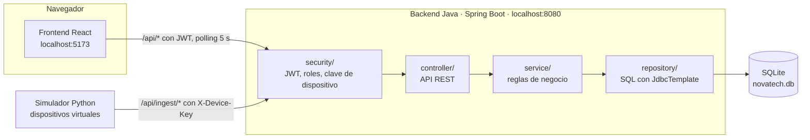
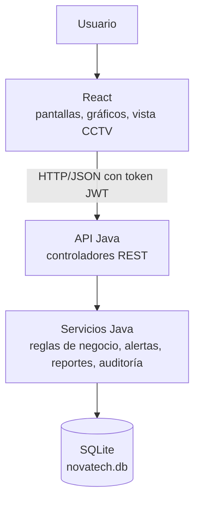
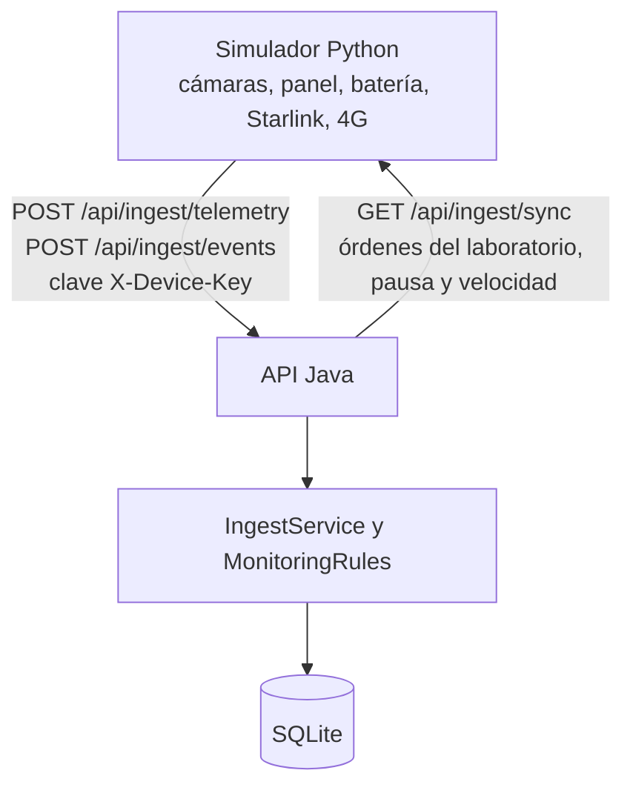
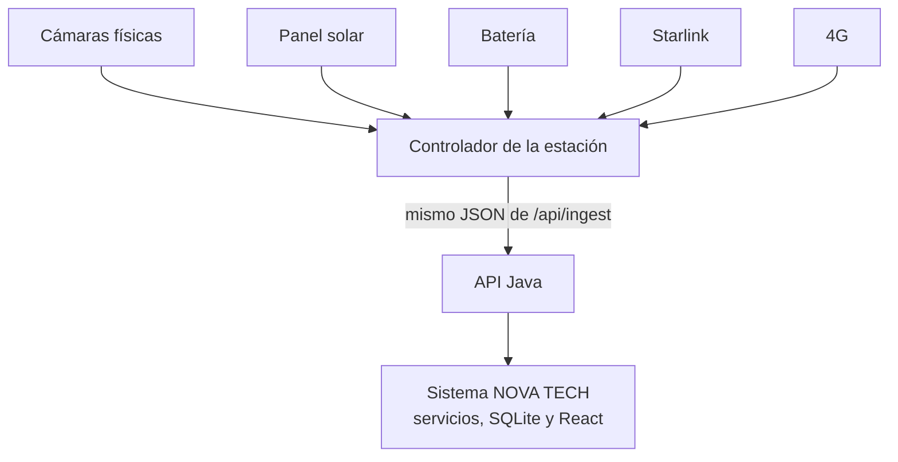
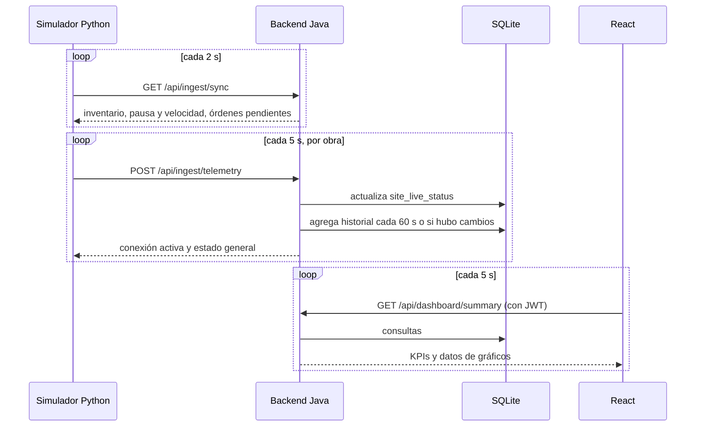
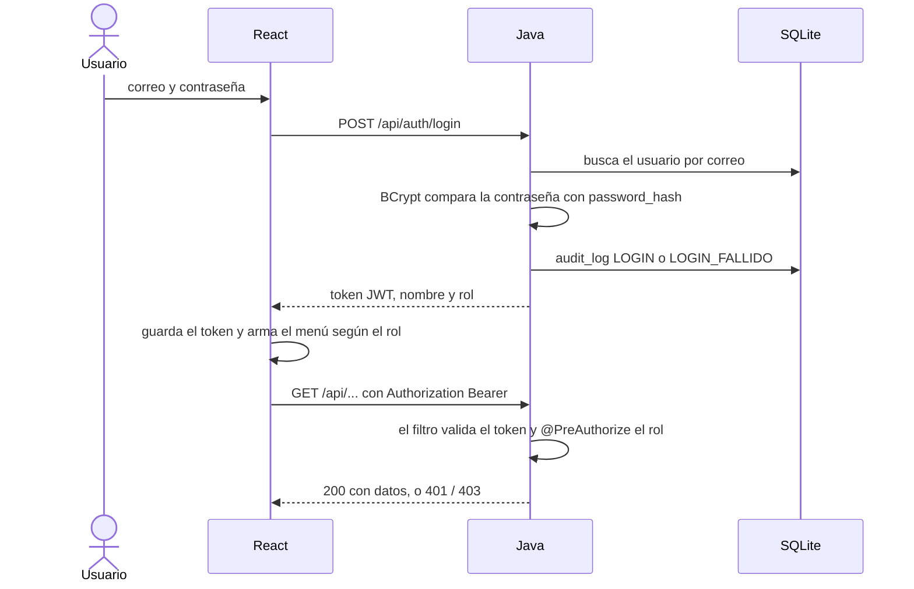
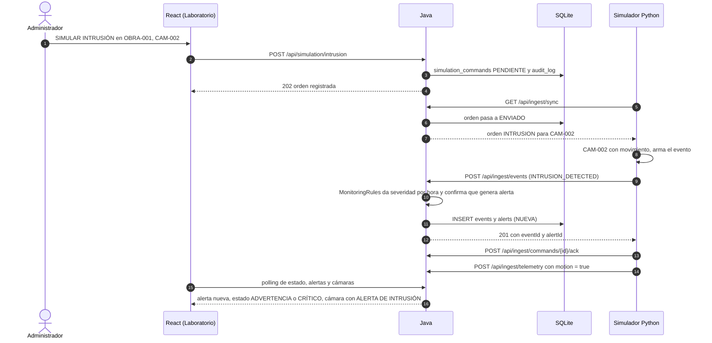
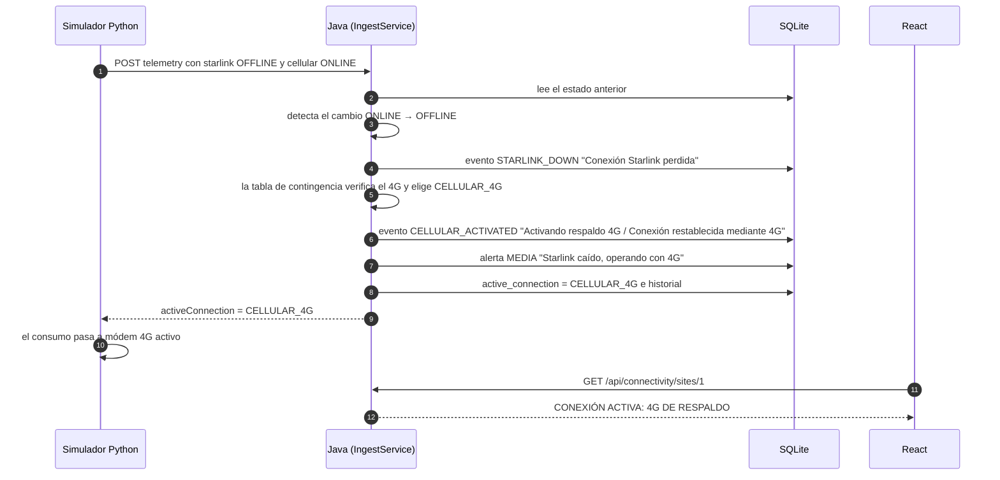
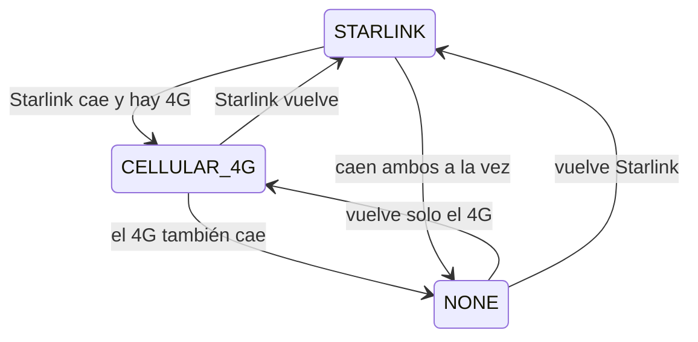

# Arquitectura de NOVA TECH

NOVA TECH es una plataforma web para vigilar obras de construcción que tienen una estación autónoma: cámaras, panel solar, batería, antena Starlink y un módem 4G de respaldo. Como el proyecto es académico y no hay equipos físicos, un simulador en Python hace de esos dispositivos. El resto del sistema funciona igual que funcionaría con equipos reales.

Todo corre en una sola computadora con Windows y no usa servicios en la nube, Docker ni colas de mensajes.

## Componentes

| Componente | Tecnología | Dirección | Función |
|---|---|---|---|
| Frontend | React 19 + JavaScript, servido por Vite | http://localhost:5173 | Interfaz del centro de monitoreo |
| Backend | Java 17 + Spring Boot 3.5 | http://localhost:8080/api | API REST, seguridad, reglas de negocio y acceso a datos |
| Simulador | Python 3.10+ con `requests` | Sin puerto: solo hace peticiones | Imita cámaras, panel solar, batería, Starlink y 4G |
| Base de datos | SQLite | `backend/data/novatech.db` | Un archivo que solo abre Java |

## Flujo del usuario

La persona que monitorea solo usa el navegador. React nunca accede a la base de datos ni al simulador: todo lo pide a la API de Java.

## Flujo de los dispositivos simulados

El simulador ocupa el lugar de los equipos. Envía lecturas crudas (por ejemplo "Starlink fuera de línea" o "batería al 15 %") y Java decide qué significan: qué eventos registrar, qué alertas crear, qué conexión usar y en qué estado queda la obra.

## Arquitectura futura con equipos reales

El canal `/api/ingest/*` es el límite entre los dispositivos y el sistema. Para pasar a equipos reales basta con que el controlador de cada estación envíe el mismo JSON que hoy envía Python. El backend, la base de datos y la interfaz no cambian; la marca "DATOS SIMULADOS" desaparece sola porque sale de la columna `simulated` de cada dispositivo.

| Capa | Hoy | Con equipos reales |
|---|---|---|
| Dispositivos | Objetos Python con valores simulados | Equipos instalados en la obra |
| Fuente de datos | El simulador llama a `/api/ingest/telemetry` y `/api/ingest/events` | El controlador de la estación llama a los mismos endpoints |
| Control | `/api/ingest/sync` entrega órdenes del laboratorio | El mismo endpoint entrega inventario y órdenes remotas; el laboratorio se retira |
| Gestión y presentación | Java, SQLite y React | Sin cambios |

## Backend Java por capas

| Paquete | Responsabilidad |
|---|---|
| `security/` | Token JWT de los usuarios, roles, clave `X-Device-Key` de los dispositivos, bloqueo temporal tras varios intentos fallidos |
| `controller/` | Endpoints REST, validación de datos de entrada y permisos con `@PreAuthorize` |
| `service/` | Lógica de negocio. `MonitoringRules` reúne las reglas: estado general, severidades, niveles de batería con histéresis, tabla de contingencia y transiciones de incidencias |
| `repository/` | Consultas SQL con `JdbcTemplate`, una clase por tabla |
| `model/` y `dto/` | Datos del dominio y formas de las respuestas |
| `config/` | Conexión a SQLite, propiedades y carga de datos iniciales (`DataSeeder`) |
| `exception/` | Convierte cualquier error en un JSON con mensaje en español |

## Ciclo normal de funcionamiento

Una orden del laboratorio se refleja en pantalla en pocos segundos: hasta 2 s para que Python la recoja y hasta 5 s para el siguiente refresco del navegador.

## Inicio de sesión y permisos

| Rol | Puede |
|---|---|
| ADMINISTRADOR | Todo: obras, dispositivos, usuarios, configuración, laboratorio de simulación, auditoría, alertas, incidencias y reportes |
| SUPERVISOR | Consultar todo, reconocer y resolver alertas, gestionar incidencias y exportar reportes |
| OPERADOR | Consultar obras, cámaras, energía, conectividad y eventos, y reconocer alertas |

La interfaz oculta lo que cada rol no puede usar, pero el control real lo hace el backend: una llamada sin permiso recibe 403.

## Escenario del laboratorio: intrusión

## Contingencia Starlink → 4G

## Seguridad

- Contraseñas guardadas con BCrypt; nunca en texto plano.
- Token JWT firmado con un secreto que se genera al instalar (`backend/data/jwt-secret.key`, fuera de Git) y vence a las 8 horas.
- Los dispositivos se autentican con la cabecera `X-Device-Key`, distinta del login de personas.
- El backend escucha solo en 127.0.0.1: no queda expuesto a la red local.
- Las acciones importantes quedan en la tabla `audit_log`.

## Decisiones principales

| Decisión | Motivo |
|---|---|
| Polling cada 5 segundos en lugar de WebSocket | Más simple y suficiente para un centro de monitoreo; el intervalo se cambia en Configuración |
| SQLite con una sola conexión y modo WAL | No requiere instalar un servidor y evita bloqueos de escritura |
| `JdbcTemplate` en lugar de JPA | Consultas SQL visibles y fáciles de seguir en un proyecto académico |
| El simulador no decide nada | Si Python eligiera la conexión o creara alertas, al cambiar a equipos reales habría que reescribir esa lógica |
| Vista CCTV con escenas ilustradas | No hay video real; las escenas, la hora y los indicadores muestran cómo se vería el monitoreo |

El detalle completo del diseño, con todas las tablas, endpoints y reglas, está en [etapa-1-diseno.md](etapa-1-diseno.md). El modelo de datos está en [database.md](database.md).
