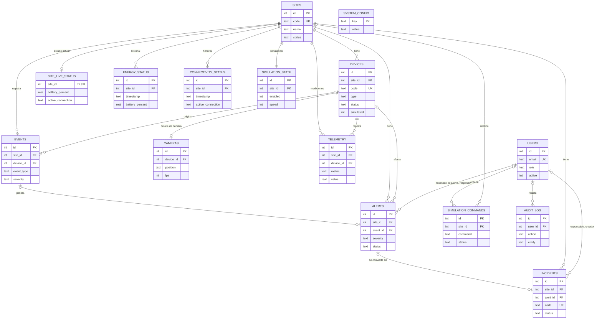

# Base de datos de NOVA TECH

La información vive en un único archivo SQLite: `backend/data/novatech.db`. No hay servidor de base de datos que instalar; el motor viene dentro del driver `sqlite-jdbc` que usa el backend. Solo Java abre ese archivo. React y el simulador Python nunca lo tocan: todo pasa por la API.

La base se crea sola en el primer arranque del backend (`install.bat` lo hace durante la instalación) a partir de `backend/src/main/resources/schema.sql`, y `DataSeeder` carga los datos de demostración. `reset_demo.bat` la borra y la vuelve a crear.

## Diagrama entidad-relación

El diagrama muestra las columnas principales de cada tabla. La lista completa está en `schema.sql` y en la sección 4.3 de [etapa-1-diseno.md](etapa-1-diseno.md).

## Tablas

Son 15: las 12 que pide el enunciado y 3 adicionales (`site_live_status`, `simulation_commands` y `system_config`).

| Tabla | Qué guarda | Cuándo se escribe |
|---|---|---|
| `users` | Usuarios, rol y hash BCrypt de la contraseña | Al crear o editar usuarios |
| `sites` | Obras: código, nombre, cliente, ubicación, fecha de instalación y estado | Al crear o editar obras; el estado cambia a SIN_CONEXION cuando caen Starlink y 4G |
| `devices` | Equipos de cada obra: cámaras, panel solar, batería, Starlink y módem 4G, con su estado y la marca `simulated` | Al registrar equipos y en cada cambio de estado |
| `cameras` | Datos propios de cada cámara: ubicación, resolución, FPS, señal, escena y detección de movimiento | Con cada telemetría |
| `site_live_status` | Foto actual de cada obra: batería, generación, consumo, conexión activa, estado general | Cada 5 segundos (se actualiza, no crece) |
| `energy_status` | Historial de energía: batería, voltaje, generación, consumo, autonomía | Cada 60 segundos y en cada cambio de estado |
| `connectivity_status` | Historial de Starlink y 4G, y conexión activa | Cada 60 segundos y en cada cambio de estado |
| `telemetry` | Mediciones sueltas por dispositivo y métrica (señal, FPS, latencia, porcentaje de batería...) | Cada 60 segundos y en cada cambio |
| `events` | Todo lo que ocurre: movimiento, intrusión, caída y recuperación de equipos, contingencias | Cuando ocurre |
| `alerts` | Eventos que requieren atención, con severidad, estado y quién los reconoció o resolvió | Cuando un evento o una condición lo exige |
| `incidents` | Seguimiento de problemas: código INC-AAAA-NNNN, prioridad, responsable, observaciones | Al crearlas y en cada cambio de estado |
| `simulation_state` | Por obra: simulación activa o en pausa, velocidad (x1, x5, x20) y último escenario | Desde el laboratorio |
| `simulation_commands` | Órdenes del laboratorio y su recorrido: PENDIENTE, ENVIADO, EJECUTADO, ERROR o EXPIRADO | Al pedir un escenario y cuando el simulador lo confirma |
| `system_config` | Parámetros editables: umbrales de batería, frecuencia de actualización y de registro, simulación | Desde la pantalla Configuración |
| `audit_log` | Acciones importantes: ingresos, cambios de usuarios y obras, alertas, incidencias, escenarios | Cuando ocurren |

## Relaciones

| Relación | Cómo se implementa |
|---|---|
| Una obra tiene varios dispositivos | `devices.site_id` |
| Una obra tiene cámaras | A través de sus dispositivos de tipo `CAMERA`; `cameras.device_id` es único |
| Una obra tiene eventos, alertas e incidencias | `events.site_id`, `alerts.site_id`, `incidents.site_id` |
| Un evento puede generar una alerta | `alerts.event_id` |
| Una alerta genera como máximo una incidencia | `incidents.alert_id` único |
| Un usuario reconoce y resuelve alertas | `alerts.acknowledged_by`, `alerts.resolved_by` |
| Un usuario es responsable de incidencias | `incidents.assigned_to` |
| Un usuario realiza acciones auditadas | `audit_log.user_id` |

Las claves foráneas están activadas (`foreign_keys=on`). Usuarios, obras y dispositivos no se borran: se desactivan o cambian de estado, así el historial nunca queda huérfano.

## Convenciones

- Nombres de tablas y columnas en inglés y en minúsculas.
- Fechas en texto con formato `AAAA-MM-DD HH:MM:SS`, en hora local.
- Booleanos como enteros 0 o 1.
- Los catálogos (roles, estados, severidades) se guardan como texto sin tildes (`CRITICA`, `EN_ATENCION`) con restricciones `CHECK`. La interfaz los muestra con tildes y espacios.
- La base trabaja en modo WAL y con una sola conexión desde Java, lo que evita los errores de "base de datos bloqueada" en SQLite.

## Catálogos

| Catálogo | Valores |
|---|---|
| Rol | ADMINISTRADOR, SUPERVISOR, OPERADOR |
| Estado de obra | ACTIVA, MANTENIMIENTO, SIN_CONEXION |
| Tipo de dispositivo | CAMERA, SOLAR_PANEL, BATTERY, STARLINK, CELLULAR_4G |
| Estado de dispositivo | ONLINE, OFFLINE, MANTENIMIENTO, FALLA |
| Severidad | INFO, BAJA, MEDIA, ALTA, CRITICA |
| Estado de alerta | NUEVA, RECONOCIDA, EN_ATENCION, RESUELTA |
| Estado de incidencia | ABIERTA, EN_PROCESO, RESUELTA, CERRADA |
| Conexión activa | STARLINK, CELLULAR_4G, NONE |
| Estado general | NORMAL, ADVERTENCIA, CRITICO |

## Datos iniciales

`DataSeeder` los carga cuando la base está vacía:

- 3 usuarios: `admin@novatech.local` / `Admin123*`, `supervisor@novatech.local` / `Supervisor123*`, `operador@novatech.local` / `Operador123*`. En la base solo queda el hash BCrypt.
- 4 obras (OBRA-001 a OBRA-004) con 12 cámaras y 28 dispositivos en total.
- 24 horas de historial de energía, conectividad y telemetría, un punto cada 5 minutos, calculado con el mismo modelo que usa el simulador.
- Episodios registrados en ese historial: una intrusión con su incidencia cerrada, una cámara caída 40 minutos, una falsa alarma, una caída de Starlink de 25 minutos con paso a 4G, dos horas nubladas y una cámara que se recupera sola.
- Estado final: todas las alertas resueltas y las cuatro obras en OPERACIÓN NORMAL.

## Volumen y retención

| Tabla | Filas por día (4 obras) | Se conserva |
|---|---|---|
| `energy_status`, `connectivity_status` | unas 5 800 cada una | 30 días |
| `telemetry` | unas 81 000 | 7 días |
| `events`, `alerts`, `incidents`, `audit_log` | decenas | siempre |

Una tarea del backend borra lo que supera esos plazos al iniciar y luego cada 6 horas. Los plazos se cambian en `application.properties` (`novatech.retention.*`).

## Consultar la base

Con el backend detenido se puede abrir `backend/data/novatech.db` con cualquier visor de SQLite, por ejemplo DB Browser for SQLite. Conviene no modificarla a mano mientras la aplicación está en marcha.

Las pruebas automáticas usan otra base, `backend/target/test-data/novatech-test.db`, que se borra en cada ejecución.
