# NOVA TECH – Etapa 1: diseño y estructura del proyecto

Sistema de Monitoreo y Vigilancia para Obras · Proyecto académico
Etapa 1 de 7 · Documento de diseño previo a la implementación · 24/09/2026

Este documento fija lo que las etapas 2 a 7 deben respetar: arquitectura, carpetas y archivos, modelo de datos, contratos entre React, Java y Python, endpoints, dependencias y orden de construcción. No contiene código del sistema. Si durante la implementación aparece un problema técnico que obligue a cambiar algo de aquí, el cambio se anota en este archivo y se informa en la entrega de esa etapa.

Las referencias del tipo §14 remiten a las secciones numeradas del enunciado.

## Contenido

0. [Decisiones principales](#0-decisiones-principales)
1. [Arquitectura final](#1-arquitectura-final)
2. [Árbol completo de carpetas](#2-árbol-completo-de-carpetas)
3. [Responsabilidad de cada componente](#3-responsabilidad-de-cada-componente)
4. [Modelo de base de datos](#4-modelo-de-base-de-datos)
5. [Flujo de información](#5-flujo-de-información)
6. [Endpoints principales](#6-endpoints-principales)
7. [Dependencias mínimas](#7-dependencias-mínimas)
8. [Orden exacto de desarrollo](#8-orden-exacto-de-desarrollo)
9. [Riesgos y mitigaciones](#9-riesgos-y-mitigaciones)
10. [Trazabilidad con los criterios de aceptación](#10-trazabilidad-con-los-criterios-de-aceptación)

---

## 0. Decisiones principales

| Tema | Decisión | Motivo |
|---|---|---|
| Ubicación | Todo el sistema vive en `novatech-monitoring/`, dentro del repositorio `Grupo4_LCD_FINAL` | El repositorio ya tiene en su raíz otro proyecto (Radar de Oportunidades en Compras Públicas, en Streamlit). NOVA TECH no modifica ninguno de esos archivos |
| Backend | Java 17 + Spring Boot 3.5 | Última línea 3.x de Spring Boot, la más documentada en material de estudio |
| Acceso a datos | Spring JDBC (`JdbcTemplate`) con SQL explícito | SQLite no tiene dialecto oficial en Hibernate; el SQL a la vista deja ver qué se guarda |
| Base de datos | SQLite, archivo `backend/data/novatech.db` creado y poblado por Java | No hay servidor de base de datos que instalar (§9) |
| Autenticación | Token JWT (HS256, librería jjwt) y contraseñas con BCrypt | El enunciado admite JWT (§42); sin cookies no hay CSRF que resolver |
| Autorización | Tres roles y `@PreAuthorize` en cada endpoint | La regla de acceso queda escrita junto al endpoint que protege |
| Frontend | React 19 con JavaScript, Vite, React Router, Recharts, lucide-react y CSS propio | Lo que pide §5, sin TypeScript ni frameworks visuales |
| React ↔ Java | REST/JSON con `fetch()` y polling cada 5 s (configurable) | §35; WebSocket no hace falta |
| Simulador | Python 3.10+ con una sola dependencia externa (`requests`) | Python hace de equipos físicos (§7) |
| Python ↔ Java | HTTP/JSON: Python envía telemetría y eventos, y consulta sus órdenes pendientes | §8, sin MQTT. Una estación real detrás de Starlink o 4G tampoco acepta conexiones entrantes |
| Reemplazo por hardware | El canal `/api/ingest/*` identifica equipos por código y no distingue simulado de real | §4: un gateway real enviaría el mismo JSON y nada más cambia |
| Reglas de negocio | Una sola clase Java, `MonitoringRules` | §18 pide reglas centralizadas y fáciles de modificar |
| Exportación | CSV generado en Java; PDF con la impresión del navegador | §37: CSV primero, PDF sin agregar librerías |
| Imágenes CCTV | Escenas de obra en SVG creadas para el proyecto, con filtro CSS | Sin video real (§21) ni imágenes de terceros |
| Windows | Scripts `.bat` y Maven Wrapper | Nadie necesita instalar Maven ni Docker (§49-51) |

---

## 1. Arquitectura final

### 1.1 Vista general

Durante la ejecución hay tres programas y un archivo de base de datos, todos en la misma computadora.

```
┌───────────────────────────────────────────────────────────────────────────┐
│ NAVEGADOR DEL USUARIO                                                     │
│ React + JavaScript + HTML + CSS · http://localhost:5173 (servidor Vite)   │
│ Login · Dashboard · Obras · CCTV · Energía · Conectividad · Alertas · ... │
└───────────────┬───────────────────────────────────────────────────────────┘
                │ REST/JSON con token JWT · polling cada 5 s
                │ React llama a /api/... y Vite lo reenvía a 127.0.0.1:8080
┌───────────────▼───────────────────────────────────────────────────────────┐
│ BACKEND JAVA · Spring Boot · http://localhost:8080/api                    │
│  security/    token JWT, roles, clave de dispositivos                     │
│  controller/  recibe HTTP, valida datos, aplica permisos                  │
│  service/     lógica de negocio, MonitoringRules, reportes, auditoría     │
│  repository/  consultas SQL con JdbcTemplate                              │
└───────────────┬──────────────────────────────────────▲────────────────────┘
                │ JDBC                                 │ HTTP/JSON + X-Device-Key
┌───────────────▼──────────────┐      ┌────────────────┴──────────────────────┐
│ SQLite                       │      │ SIMULADOR PYTHON (fuente de datos)     │
│ backend/data/novatech.db     │      │ cámaras, panel solar, batería,         │
│ 15 tablas                    │      │ Starlink, 4G, movimiento, intrusión,   │
└──────────────────────────────┘      │ fallas, recuperación, reloj virtual    │
                                      └────────────────────────────────────────┘
```

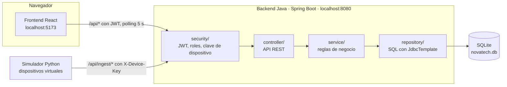

| Programa | Tecnología | Dirección | Función |
|---|---|---|---|
| Frontend | React + JavaScript + HTML + CSS, servido por Vite | http://localhost:5173 | Interfaz del centro de monitoreo |
| Backend | Java 17 + Spring Boot | http://localhost:8080/api | API, seguridad, reglas de negocio y persistencia |
| Simulador | Python 3 | Sin puerto (solo hace peticiones) | Imita cámaras, panel solar, batería, Starlink y 4G |
| Base de datos | SQLite | `backend/data/novatech.db` | Un archivo que crea y usa solo Java |

### 1.2 Dispositivos, fuente de datos y sistema de gestión

§4 exige que la simulación pueda reemplazarse por equipos físicos sin rediseñar el sistema. El límite entre ambos mundos es el canal `/api/ingest/*`: lo que está de un lado no conoce los detalles del otro.

| Capa | Hoy (proyecto académico) | Mañana (equipos reales) |
|---|---|---|
| Dispositivos | Objetos Python que imitan cámaras, panel, batería, Starlink y 4G | Equipos instalados en la estación de la obra |
| Fuente de datos | El simulador envía `POST /api/ingest/telemetry` y `POST /api/ingest/events` | El gateway o controlador de la estación envía los mismos endpoints con el mismo JSON |
| Canal de control | `GET /api/ingest/sync` entrega inventario, pausa, velocidad y órdenes del laboratorio | El mismo endpoint entrega inventario y órdenes remotas; las órdenes de laboratorio dejan de existir |
| Sistema de gestión | Backend Java + SQLite | Sin cambios |
| Presentación | React | Sin cambios |

Cinco reglas sostienen esa separación:

1. React nunca habla con Python. Solo consume `/api/*` del backend.
2. Los equipos se identifican por su código (`CAM-001`, `STL-001`), nunca por el id interno de la base de datos.
3. La fuente envía lecturas crudas (Starlink caído, batería al 15 %). Java decide los eventos, las alertas, la conexión activa y el estado general.
4. Cada dispositivo tiene la columna `simulated`. La interfaz muestra la marca "DATOS SIMULADOS" a partir de ese dato; con equipos reales la marca desaparece sin tocar código.
5. Lo único específico del simulador es el laboratorio (`/api/simulation/*`) y los campos de reloj y órdenes de `sync`. Si se quitan, el resto sigue funcionando.

Arquitectura actual:

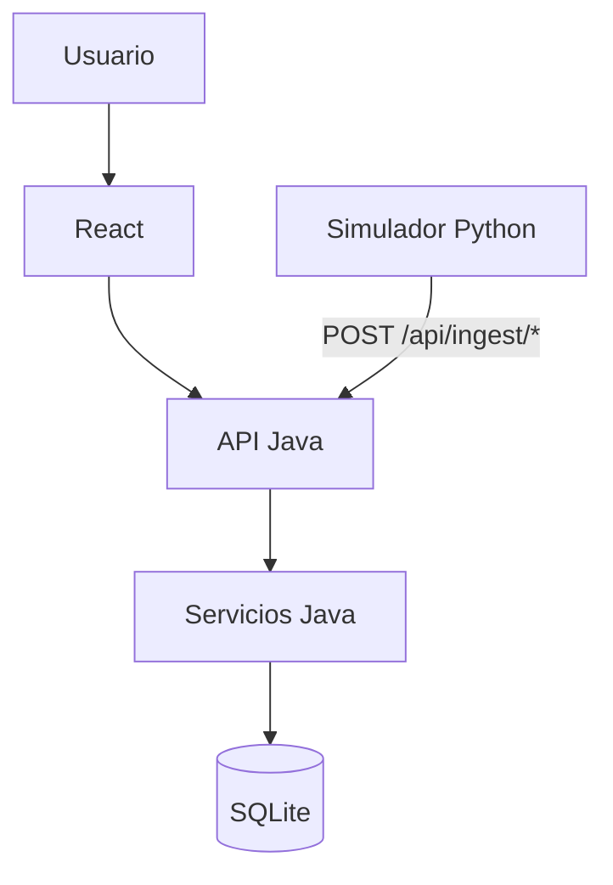

Arquitectura futura con equipos reales:

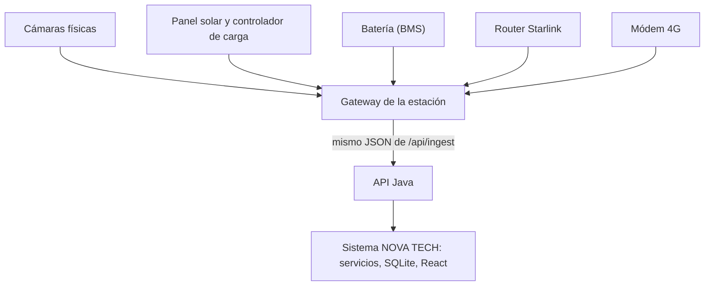

### 1.3 Tecnologías y versiones

Las versiones se verificaron contra Maven Central, npm y PyPI el 24/09/2026. Se fijan exactas para que la instalación sea repetible.

| Uso | Tecnología | Versión |
|---|---|---|
| Lenguaje del backend | Java (JDK) | 17 o superior; también se prueba con 21 |
| Framework del backend | Spring Boot (Web, JDBC, Security, Validation) | 3.5.16 |
| Construcción | Maven Wrapper, descarga Maven solo | 3.3.4 (Maven 3.9.x) |
| Driver de base de datos | sqlite-jdbc (xerial) | 3.53.4.0 |
| Tokens | jjwt (api, impl, jackson) | 0.13.0 |
| Interfaz | React y React DOM | 19.3.0 |
| Navegación | react-router-dom | 7.18.4 |
| Gráficos | recharts | 3.10.1 |
| Íconos | lucide-react | 1.48.0 |
| Servidor de desarrollo | vite y @vitejs/plugin-react | 8.3.1 y 6.1.1 |
| Entorno del frontend | Node.js (incluye npm) | 20.19+ o 22.12+ (se recomienda el LTS 22 o 24) |
| Simulador | Python | 3.10 o superior |
| HTTP en Python | requests | 2.34.2 |
| Pruebas del backend | JUnit 5, Spring Boot Test, spring-security-test | Incluidas en Spring Boot |
| Pruebas del simulador | unittest | Biblioteca estándar |

### 1.4 Decisiones de diseño

#### Spring Boot 3.5 y no 4.x

Spring Boot 4 (noviembre de 2025) pasó a Jackson 3 y reorganizó varios módulos, entre ellos los de pruebas. Casi todo el material de estudio disponible sigue en 3.x, así que se usa 3.5.16, la versión de mantenimiento más reciente de esa línea. Migrar más adelante es un cambio acotado que no toca el diseño.

#### Spring JDBC en lugar de JPA

Hibernate no trae dialecto oficial para SQLite; hay uno comunitario, con limitaciones en fechas y en `ALTER TABLE`. Con `JdbcTemplate` cada repositorio muestra la consulta completa, la estructura de la base de datos vive en un único `schema.sql` y las fechas se guardan como texto legible. Para estudiantes que ya vieron SQL es más fácil seguir el recorrido de cada dato. El costo es escribir a mano la conversión de fila a objeto: una función por tabla.

#### Records de Java para modelo y DTO

Las entidades y los objetos de transporte son `record` de Java 17. Una línea declara todos los campos, sin getters ni setters escritos a mano y sin Lombok. Los DTO de cada módulo van juntos en un archivo (`SiteDtos.java`, `AlertDtos.java`) para no llenar el proyecto de clases de diez líneas.

#### Sesión con JWT

Al iniciar sesión, Java compara la contraseña con el hash BCrypt y devuelve un token firmado (HS256) con id, correo y rol, válido por 8 horas, lo que dura un turno. React lo guarda en `sessionStorage` y lo envía en la cabecera `Authorization`. Sin cookies no hay ataques CSRF que prevenir, y reiniciar el backend no cierra las sesiones abiertas. En cada petición el filtro verifica que el usuario siga activo, así que desactivar a alguien le corta el acceso de inmediato. El secreto de firma se genera al azar en el primer arranque y se guarda en `backend/data/jwt-secret.key`, fuera de Git.

#### Python pregunta y Java responde

El laboratorio tiene que mandarle órdenes a Python ("simula una intrusión en OBRA-001"). En lugar de convertir el simulador en servidor, Java guarda la orden en la tabla `simulation_commands` y Python la recoge cuando consulta `GET /api/ingest/sync`, cada 2 segundos. Python queda como simple cliente HTTP y no hay un segundo servidor que configurar. Así funcionan también los equipos reales: detrás de Starlink o de una red 4G con CGNAT, la estación no puede recibir conexiones y es ella la que consulta al servidor. Una orden que nadie recoge en 2 minutos (simulador apagado) pasa a `EXPIRADO` para que no se ejecute tarde.

#### Python informa y Java decide

El simulador envía lo que "mide": Starlink en línea o caído, batería al 15 %, cámara sin señal. No crea alertas ni elige la conexión. Java compara cada lectura con el estado anterior, registra un evento por cada cambio y aplica `MonitoringRules` para crear o resolver alertas y decidir si la obra usa Starlink, 4G o ninguna. Con equipos reales, las reglas siguen en el mismo lugar.

#### Estado actual separado del historial

La telemetría llega cada 5 segundos por obra. Java actualiza en cada envío una sola fila por obra en `site_live_status` (el estado actual) y agrega filas de historial en `energy_status`, `connectivity_status` y `telemetry` cada 60 segundos, valor configurable (§36, §43). También guarda una fila de historial en el momento en que cambia algún estado, para que un corte de Starlink de 20 segundos no se pierda en los reportes.

#### SQLite con una sola conexión

SQLite acepta un solo escritor a la vez; con varias conexiones escribiendo (simulador y usuarios) aparece el error `database is locked`. El pool se limita a una conexión y se activan tres opciones de SQLite: WAL, que además permite abrir la base con DB Browser for SQLite mientras la aplicación corre; `busy_timeout` de 5 s y claves foráneas. Esta aplicación hace unas pocas escrituras por segundo, y para eso una conexión sobra.

#### Proxy de Vite y 127.0.0.1

React llama siempre a rutas relativas `/api/...` y el servidor de Vite las reenvía a Java. Para el navegador, página y API tienen el mismo origen, así que no hay problemas de CORS. El backend escucha solo en `127.0.0.1`: no queda expuesto a la red local y Windows no muestra el aviso del firewall al arrancar Java. El proxy y el simulador apuntan a `127.0.0.1` y no a `localhost`, porque desde Node 17 `localhost` puede resolverse a la dirección IPv6 `::1` y la conexión fallaría.

#### Fechas como texto en hora local

Todas las fechas se guardan como `YYYY-MM-DD HH:MM:SS` en la hora local del equipo. Así ordenadas alfabéticamente quedan también en orden cronológico, se leen tal cual al abrir la base y SQLite puede operar con ellas (`datetime`, `strftime`). Todo corre en una computadora, así que no hace falta manejar zonas horarias.

#### Nada se borra físicamente

Usuarios, obras y dispositivos no se eliminan: se desactivan o pasan a mantenimiento. Los eventos, alertas e incidencias antiguos siguen apuntando a registros que existen, y la auditoría conserva su sentido.

#### Reportes en CSV y PDF

Java calcula los reportes y los entrega también en CSV (UTF-8 con BOM, para que Excel en Windows muestre bien las tildes). El PDF se obtiene con el botón "Imprimir / Guardar PDF", que abre la impresión del navegador con una hoja de estilos preparada para papel. No se agrega ninguna librería.

#### Vista CCTV sin video

Cada cámara muestra una escena de obra dibujada en SVG para este proyecto (acceso, perímetro, materiales, acceso vehicular, grúa, maquinaria) y encima los datos en vivo: nombre, hora, REC, estado, movimiento y último evento. Un filtro CSS le da aspecto de cámara de seguridad y, cuando la hora virtual es de noche, imita el modo infrarrojo en blanco y negro. No hay reconocimiento de personas ni visión artificial (§21, §58).

#### Idioma

La interfaz, los mensajes de error de la API, la consola del simulador, los comentarios del código y la documentación están en español. Los nombres de clases, tablas y columnas están en inglés, igual que el modelo de datos del enunciado (§38).

### 1.5 Seguridad

| Aspecto | Solución |
|---|---|
| Contraseñas | Hash BCrypt. Nunca se guardan ni se devuelven en texto plano |
| Sesión | JWT con vencimiento de 8 h. Al vencer, React vuelve al login con el aviso "Su sesión expiró" |
| Autorización | `@PreAuthorize` en cada endpoint. React oculta menús y botones, pero quien protege es Java: una petición sin permiso recibe 403 |
| Dispositivos | Cabecera `X-Device-Key` con una clave configurable, solo para `/api/ingest/*` |
| Fuerza bruta | Tras 5 intentos fallidos seguidos con el mismo correo, ese correo queda bloqueado 5 minutos |
| Validación | Anotaciones de Bean Validation en todos los cuerpos JSON, con mensajes en español. Todo el SQL usa parámetros `?` |
| Errores | Un único formato JSON de error; el navegador nunca recibe trazas internas de Java |
| Auditoría | Login, cambios de datos, acciones sobre alertas e incidencias, escenarios y configuración (§44) |

---

## 2. Árbol completo de carpetas

La etiqueta `[E2]` indica la etapa en que se crea cada archivo. Frente a la estructura sugerida en §48 se agregan pocas cosas y con un propósito concreto: `dto/` y `exception/` en Java; `context/`, `hooks/` y `utils/` en React; `station_simulator.py` y `tests/` en Python; `stop_app.bat` y `run_tests.bat` en la raíz.

```
novatech-monitoring/
├── README.md                              [E7] (provisional desde E1)
├── .gitignore                             [E2] reincluye *.bat; ignora data/, target/, node_modules/, .venv/
├── .gitattributes                         [E2] fuerza CRLF en .bat y .cmd
├── install.bat                            [E7] verifica requisitos, instala dependencias, crea la BD
├── start_app.bat                          [E7] inicia backend, simulador y frontend
├── stop_app.bat                           [E7] cierra las tres ventanas
├── reset_demo.bat                         [E7] reconstruye la BD con los datos iniciales
├── run_tests.bat                          [E6] pruebas del backend y del simulador
├── docs/
│   ├── etapa-1-diseno.md                  [E1] este documento
│   ├── architecture.md                    [E7] arquitectura final con Mermaid
│   ├── database.md                        [E7] modelo entidad-relación
│   └── guia-demostracion.md               [E7] guion del escenario de §56 paso a paso
│
├── backend/
│   ├── pom.xml                            [E2]
│   ├── mvnw                               [E2] Maven Wrapper (Linux/macOS)
│   ├── mvnw.cmd                           [E2] Maven Wrapper (Windows)
│   ├── .mvn/wrapper/maven-wrapper.properties [E2]
│   ├── data/                              (se crea al ejecutar, no se versiona)
│   │   ├── novatech.db                    base SQLite
│   │   └── jwt-secret.key                 secreto de firma de tokens
│   └── src/
│       ├── main/
│       │   ├── java/com/novatech/monitoring/
│       │   │   ├── NovatechApplication.java           [E2] punto de entrada; crea backend/data/
│       │   │   ├── config/
│       │   │   │   ├── AppProperties.java             [E2] propiedades novatech.*
│       │   │   │   ├── DatabaseConfig.java            [E2] conexión SQLite (agregado en la Etapa 2)
│       │   │   │   └── DataSeeder.java                [E2] datos iniciales y 24 h de historia
│       │   │   ├── security/
│       │   │   │   ├── SecurityConfig.java            [E2]
│       │   │   │   ├── JwtService.java                [E2]
│       │   │   │   ├── JwtAuthenticationFilter.java   [E2]
│       │   │   │   ├── DeviceKeyFilter.java           [E2]
│       │   │   │   ├── JsonAuthErrorHandler.java      [E2]
│       │   │   │   ├── LoginAttemptService.java       [E2]
│       │   │   │   ├── AuthenticatedUser.java         [E2]
│       │   │   │   └── Roles.java                     [E2]
│       │   │   ├── model/
│       │   │   │   ├── Role.java                      [E2] enum ADMINISTRADOR, SUPERVISOR, OPERADOR
│       │   │   │   ├── Severity.java                  [E2] enum INFO ... CRITICA
│       │   │   │   ├── EventType.java                 [E2] enum de tipos de evento
│       │   │   │   ├── ConnectionType.java            [E2] enum STARLINK, CELLULAR_4G, NONE
│       │   │   │   ├── GeneralState.java              [E2] enum NORMAL, ADVERTENCIA, CRITICO
│       │   │   │   ├── Scenario.java                  [E2] enum de escenarios del laboratorio
│       │   │   │   ├── User.java                      [E2] record (tabla users)
│       │   │   │   ├── Site.java                      [E2] record + enum Status
│       │   │   │   ├── Device.java                    [E2] record + enums Type y Status
│       │   │   │   ├── Camera.java                    [E2]
│       │   │   │   ├── SiteLiveStatus.java            [E2]
│       │   │   │   ├── EnergyStatus.java              [E2]
│       │   │   │   ├── ConnectivityStatus.java        [E2]
│       │   │   │   ├── TelemetryRecord.java           [E2]
│       │   │   │   ├── Event.java                     [E2]
│       │   │   │   ├── Alert.java                     [E2] record + enum Status
│       │   │   │   ├── Incident.java                  [E2] record + enum Status
│       │   │   │   ├── SimulationState.java           [E2]
│       │   │   │   ├── SimulationCommand.java         [E2] record + enum Status
│       │   │   │   └── AuditLog.java                  [E2]
│       │   │   ├── dto/
│       │   │   │   ├── AuthDtos.java                  [E2]
│       │   │   │   ├── UserDtos.java                  [E2]
│       │   │   │   ├── SiteDtos.java                  [E2]
│       │   │   │   ├── DeviceDtos.java                [E2] incluye la vista de cámara
│       │   │   │   ├── MonitoringDtos.java            [E2] energía, conectividad, telemetría
│       │   │   │   ├── AlertDtos.java                 [E2]
│       │   │   │   ├── IncidentDtos.java              [E2]
│       │   │   │   ├── DashboardDtos.java             [E2]
│       │   │   │   ├── ReportDtos.java                [E2]
│       │   │   │   ├── SimulationDtos.java            [E2]
│       │   │   │   ├── IngestDtos.java                [E2] contrato con Python y equipos reales
│       │   │   │   ├── ConfigDtos.java                [E2]
│       │   │   │   └── PageResponse.java              [E2] respuesta paginada genérica
│       │   │   ├── repository/
│       │   │   │   ├── SqlUtils.java                  [E2] conversión de fechas y ayudas SQL
│       │   │   │   ├── UserRepository.java            [E2]
│       │   │   │   ├── SiteRepository.java            [E2]
│       │   │   │   ├── DeviceRepository.java          [E2]
│       │   │   │   ├── CameraRepository.java          [E2]
│       │   │   │   ├── SiteLiveStatusRepository.java  [E2]
│       │   │   │   ├── EnergyStatusRepository.java    [E2]
│       │   │   │   ├── ConnectivityStatusRepository.java [E2]
│       │   │   │   ├── TelemetryRepository.java       [E2]
│       │   │   │   ├── EventRepository.java           [E2]
│       │   │   │   ├── AlertRepository.java           [E2]
│       │   │   │   ├── IncidentRepository.java        [E2]
│       │   │   │   ├── SimulationRepository.java      [E2] simulation_state y simulation_commands
│       │   │   │   ├── ConfigRepository.java          [E2]
│       │   │   │   └── AuditLogRepository.java        [E2]
│       │   │   ├── service/
│       │   │   │   ├── MonitoringRules.java           [E2] TODAS las reglas de negocio
│       │   │   │   ├── AuthService.java               [E2]
│       │   │   │   ├── UserService.java               [E2]
│       │   │   │   ├── SiteService.java               [E2]
│       │   │   │   ├── DeviceService.java             [E2]
│       │   │   │   ├── CameraService.java             [E2]
│       │   │   │   ├── EnergyService.java             [E2]
│       │   │   │   ├── ConnectivityService.java       [E2]
│       │   │   │   ├── TelemetryService.java          [E2]
│       │   │   │   ├── IngestService.java             [E2] procesa lo que envían los equipos
│       │   │   │   ├── EventService.java              [E2]
│       │   │   │   ├── AlertService.java              [E2]
│       │   │   │   ├── IncidentService.java           [E2]
│       │   │   │   ├── DashboardService.java          [E2]
│       │   │   │   ├── ReportService.java             [E2]
│       │   │   │   ├── SimulationService.java         [E2]
│       │   │   │   ├── ConfigService.java             [E2]
│       │   │   │   └── AuditService.java              [E2]
│       │   │   ├── controller/
│       │   │   │   ├── AuthController.java            [E2] /api/auth
│       │   │   │   ├── HealthController.java          [E2] /api/health
│       │   │   │   ├── UserController.java            [E2] /api/users
│       │   │   │   ├── SiteController.java            [E2] /api/sites
│       │   │   │   ├── DeviceController.java          [E2] /api/devices
│       │   │   │   ├── CameraController.java          [E2] /api/cameras
│       │   │   │   ├── EnergyController.java          [E2] /api/energy
│       │   │   │   ├── ConnectivityController.java    [E2] /api/connectivity
│       │   │   │   ├── TelemetryController.java       [E2] /api/telemetry
│       │   │   │   ├── EventController.java           [E2] /api/events
│       │   │   │   ├── AlertController.java           [E2] /api/alerts
│       │   │   │   ├── IncidentController.java        [E2] /api/incidents
│       │   │   │   ├── DashboardController.java       [E2] /api/dashboard
│       │   │   │   ├── ReportController.java          [E2] /api/reports
│       │   │   │   ├── SimulationController.java      [E2] /api/simulation (laboratorio)
│       │   │   │   ├── IngestController.java          [E2] /api/ingest (equipos)
│       │   │   │   ├── ConfigController.java          [E2] /api/config
│       │   │   │   └── AuditController.java           [E2] /api/audit
│       │   │   └── exception/
│       │   │       ├── ApiException.java              [E2] error de negocio con código HTTP
│       │   │       └── GlobalExceptionHandler.java    [E2] convierte errores en JSON
│       │   └── resources/
│       │       ├── application.properties             [E2]
│       │       └── schema.sql                         [E2] 15 tablas e índices (CREATE ... IF NOT EXISTS)
│       └── test/
│           ├── java/com/novatech/monitoring/
│           │   ├── ApiTestSupport.java                [E6] login de prueba y utilidades
│           │   ├── AuthAndPermissionsTest.java        [E6] login y permisos
│           │   ├── SiteApiTest.java                   [E6] consulta de obras
│           │   ├── IngestEventsAlertsTest.java        [E6] eventos, alertas, intrusión
│           │   ├── ConnectivityFailoverTest.java      [E6] falla Starlink y cambio a 4G
│           │   ├── BatteryAlertsTest.java             [E6] batería baja y crítica
│           │   ├── AlertIncidentWorkflowTest.java     [E6] reconocer, incidencia, resolver
│           │   └── MonitoringRulesTest.java           [E6] reglas puras, sin base de datos
│           └── resources/
│               └── application-test.properties       [E6] base de datos aparte para pruebas
│
├── simulator/
│   ├── requirements.txt                   [E3] requests==2.34.2
│   ├── config.py                          [E3] URL, clave, intervalos y valores demostrativos
│   ├── main.py                            [E3] bucle principal
│   ├── api_client.py                      [E3] comunicación HTTP con Java
│   ├── station_simulator.py               [E3] una estación por obra: reloj virtual y escenarios
│   ├── camera_simulator.py                [E3]
│   ├── energy_simulator.py                [E3]
│   ├── connectivity_simulator.py          [E3]
│   ├── event_simulator.py                 [E3]
│   ├── sim_utils.py                       [E3] variación acotada (RandomWalk) y límites (agregado en la Etapa 3)
│   ├── tests/
│   │   ├── __init__.py                    [E3]
│   │   ├── test_simulator.py              [E3] pruebas unitarias del modelo
│   │   └── check_demo_flow.py             [E6] verificación del flujo completo con el sistema corriendo
│   └── .venv/                             (lo crea install.bat, no se versiona)
│
└── frontend/
    ├── package.json                       [E4]
    ├── package-lock.json                  [E4] se versiona; incluye binarios de Windows
    ├── vite.config.js                     [E4] puerto 5173 y proxy /api → 127.0.0.1:8080
    ├── index.html                         [E4]
    ├── public/
    │   └── favicon.svg                    [E4]
    └── src/
        ├── main.jsx                       [E4]
        ├── App.jsx                        [E4] rutas y rutas protegidas
        ├── assets/
        │   ├── logo-novatech.svg          [E4]
        │   └── cameras/                   [E4] escenas CCTV en SVG
        │       ├── acceso.svg
        │       ├── perimetro.svg
        │       ├── materiales.svg
        │       ├── vehicular.svg
        │       ├── grua.svg
        │       └── maquinaria.svg
        ├── styles/
        │   ├── global.css                 [E4] colores, tipografía, estructura
        │   ├── components.css             [E4] tarjetas, badges, tablas, formularios, modales
        │   └── pages.css                  [E4] login, dashboard, CCTV, laboratorio, impresión
        ├── services/
        │   └── api.js                     [E4] fetch con token, manejo de errores, funciones por recurso
        ├── context/
        │   ├── AuthContext.jsx            [E4] usuario, rol, login y logout
        │   └── ToastContext.jsx           [E4] avisos breves
        ├── hooks/
        │   └── usePolling.js              [E4] actualización periódica
        ├── utils/
        │   ├── format.js                  [E4] fechas, números, duraciones
        │   ├── labels.js                  [E4] textos en español de estados, severidades y tipos
        │   └── permissions.js             [E4] menú y acciones por rol
        ├── components/
        │   ├── layout/
        │   │   ├── AppLayout.jsx          [E4]
        │   │   ├── Sidebar.jsx            [E4]
        │   │   └── Header.jsx             [E4]
        │   ├── common/
        │   │   ├── ProtectedRoute.jsx     [E4]
        │   │   ├── ErrorBoundary.jsx      [E4] evita la pantalla en blanco
        │   │   ├── PageHeader.jsx         [E4]
        │   │   ├── KpiCard.jsx            [E4]
        │   │   ├── Badges.jsx             [E4] estado, severidad, estado general
        │   │   ├── GeneralStateIndicator.jsx [E4] indicador grande del centro de control
        │   │   ├── ProgressBar.jsx        [E4]
        │   │   ├── Modal.jsx              [E4]
        │   │   ├── Tabs.jsx               [E4]
        │   │   ├── Pagination.jsx         [E4]
        │   │   ├── Feedback.jsx           [E4] estados de carga, error y vacío
        │   │   └── SimulatedNotice.jsx    [E4] aviso de valores simulados
        │   ├── charts/
        │   │   ├── DashboardCharts.jsx    [E4] cámaras, alertas 24 h, batería por obra, conectividad
        │   │   ├── EnergyCharts.jsx       [E4] nivel de batería, generación vs consumo
        │   │   └── TimeSeriesChart.jsx    [E4] latencia y telemetría
        │   ├── cameras/
        │   │   ├── CameraTile.jsx         [E4]
        │   │   ├── CameraGrid.jsx         [E4]
        │   │   └── CameraDetailModal.jsx  [E4]
        │   ├── monitoring/
        │   │   ├── EnergyPanel.jsx        [E4]
        │   │   ├── ConnectivityPanel.jsx  [E4]
        │   │   └── FailoverTimeline.jsx   [E4] "Conexión Starlink perdida → ..."
        │   ├── alerts/
        │   │   ├── AlertsTable.jsx        [E4]
        │   │   └── ResolveAlertModal.jsx  [E4]
        │   ├── incidents/
        │   │   ├── IncidentsTable.jsx     [E4]
        │   │   ├── IncidentFormModal.jsx  [E4]
        │   │   └── IncidentDetailModal.jsx [E4]
        │   ├── events/
        │   │   └── EventsTable.jsx        [E4]
        │   └── sites/
        │       ├── SiteFormModal.jsx      [E4]
        │       ├── DeviceInventory.jsx    [E4]
        │       └── DeviceFormModal.jsx    [E4]
        └── pages/
            ├── LoginPage.jsx              [E4]
            ├── DashboardPage.jsx          [E4]
            ├── SitesPage.jsx              [E4]
            ├── SiteControlCenterPage.jsx  [E4]
            ├── site-tabs/
            │   ├── OverviewTab.jsx        [E4] Vista general
            │   ├── CamerasTab.jsx         [E4]
            │   ├── EnergyTab.jsx          [E4]
            │   ├── CommunicationsTab.jsx  [E4]
            │   ├── EventsTab.jsx          [E4]
            │   ├── AlertsTab.jsx          [E4]
            │   ├── IncidentsTab.jsx       [E4]
            │   └── TelemetryTab.jsx       [E4]
            ├── CamerasPage.jsx            [E4]
            ├── EnergyPage.jsx             [E4]
            ├── ConnectivityPage.jsx       [E4]
            ├── AlertsPage.jsx             [E4]
            ├── IncidentsPage.jsx          [E4]
            ├── ReportsPage.jsx            [E4]
            ├── SimulationLabPage.jsx      [E4]
            ├── UsersPage.jsx              [E4]
            ├── SettingsPage.jsx           [E4]
            ├── AuditPage.jsx              [E4]
            ├── ForbiddenPage.jsx          [E4] 403
            └── NotFoundPage.jsx           [E4] 404
```

Tamaño aproximado: 113 archivos en el backend (incluidas las pruebas), 81 en el frontend, 13 en el simulador y 12 en la raíz y `docs/`. Cada archivo tiene una responsabilidad; los DTO y los componentes muy pequeños se agruparon para no inflar el conteo.

Dos detalles de Git ya comprobados en este repositorio:

- El `.gitignore` de la raíz ignora `*.bat`. `novatech-monitoring/.gitignore` vuelve a incluirlos con la regla `!*.bat` (verificado con `git check-ignore`).
- Los archivos `.bat` necesitan saltos de línea CRLF para que `cmd.exe` los ejecute bien; `.gitattributes` lo asegura aunque se editen en Linux o macOS.

---

## 3. Responsabilidad de cada componente

### 3.1 Qué hace cada tecnología (§60)

| Tecnología | Se ocupa de | No se ocupa de |
|---|---|---|
| React + HTML + CSS + JavaScript | Pantallas, navegación, formularios, gráficos, CCTV, actualización periódica | Reglas de negocio, contacto con Python, acceso a la base de datos |
| Java (Spring Boot) | API, login, roles, obras, dispositivos, cámaras, energía, conectividad, eventos, alertas, incidencias, reglas, reportes, auditoría, persistencia, recepción de datos de campo | Simular equipos |
| Python | Imitar cámaras, panel solar, batería, Starlink y 4G; movimiento, intrusión, fallas, recuperación; reloj virtual | Escribir en SQLite, crear alertas, decidir la conexión activa |
| SQLite | Guardar todos los datos en un archivo | Lógica (no hay triggers ni procedimientos) |

### 3.2 Backend Java

Paquete base: `com.novatech.monitoring`. Artefacto: `novatech-backend.jar`.

| Paquete | Clase | Responsabilidad |
|---|---|---|
| (raíz) | `NovatechApplication` | Arranca Spring Boot, activa las tareas programadas y crea la carpeta `data/` antes de abrir la base |
| config | `AppProperties` | Lee las propiedades `novatech.*`: ruta de la base, duración del token, clave de dispositivos, orígenes CORS, retención de datos |
| config | `DatabaseConfig` | Arma la conexión a SQLite: crea la carpeta `data/`, un pool de una conexión, WAL, `busy_timeout` y claves foráneas (agregado en la Etapa 2) |
| config | `DataSeeder` | Si la base está vacía, carga usuarios, obras, dispositivos, cámaras, estado actual, 24 h de historia, eventos, alertas, incidencias, auditoría, configuración y estado de simulación. Con `--novatech.exit-after-init=true` carga los datos y termina (lo usan `install.bat` y `reset_demo.bat`) |
| security | `SecurityConfig` | Cadena de filtros: `/api/auth/login` y `/api/health` públicos; `/api/ingest/**` solo con clave de dispositivo; el resto requiere token. Sin sesión en servidor, CORS para `localhost:5173`, BCrypt |
| security | `JwtService` | Genera y valida tokens (id, correo, rol, vencimiento). Crea `data/jwt-secret.key` si no existe |
| security | `JwtAuthenticationFilter` | Lee `Authorization: Bearer ...`, valida el token, comprueba que el usuario siga activo y registra su rol |
| security | `DeviceKeyFilter` | Valida la cabecera `X-Device-Key` en `/api/ingest/**` |
| security | `JsonAuthErrorHandler` | Respuestas 401 y 403 en JSON y en español |
| security | `LoginAttemptService` | Cuenta intentos fallidos por correo y bloquea 5 minutos tras 5 fallos |
| security | `AuthenticatedUser` | Datos del usuario de la petición (id, nombre, correo, rol) |
| security | `Roles` | Expresiones de permiso reutilizables: `ADMIN`, `ADMIN_O_SUPERVISOR`, `CUALQUIER_ROL` |
| model | 14 records y 6 enums | Una fila de cada tabla y los catálogos de valores (sección 4.5) |
| dto | 13 archivos | Formas de entrada y salida de la API, agrupadas por módulo. Las anotaciones de validación viven aquí |
| repository | `SqlUtils` | Conversión entre `LocalDateTime` y texto; armado seguro de filtros y paginación |
| repository | Un repositorio por tabla | Todo el SQL de su tabla: consultas, inserciones, actualizaciones. `SimulationRepository` atiende `simulation_state` y `simulation_commands` |
| service | `MonitoringRules` | Reglas del negocio en un solo lugar: estado general, qué eventos generan alerta y con qué severidad, niveles de batería con histéresis, tabla de contingencia Starlink/4G, horario laboral para intrusiones, qué alertas se resuelven solas |
| service | `IngestService` | Procesa la telemetría y los eventos de los equipos: detecta cambios, registra eventos, crea y resuelve alertas, decide la conexión activa, actualiza el estado actual y guarda historial (sección 5.3) |
| service | `AuthService` | Login, datos del usuario actual, registro de ingresos y salidas |
| service | `UserService` | Alta y edición de usuarios; correo único; impide desactivar o degradar al último administrador activo |
| service | `SiteService` | Lista con filtros y búsqueda; detalle con estado general; alta de obra con su estación estándar (2 a 4 cámaras, panel, batería, Starlink, 4G) |
| service | `DeviceService` | Inventario; alta de cámaras (máximo 4 por obra); edición; entrada y salida de mantenimiento |
| service | `CameraService` | Vista de cámaras con estado en vivo, intrusión activa y último evento |
| service | `EnergyService` | Estado energético actual y series históricas reducidas para gráficos |
| service | `ConnectivityService` | Estado de Starlink y 4G, totales por tipo de conexión, historial y línea de tiempo de contingencias |
| service | `TelemetryService` | Consultas de la pestaña Telemetría y limpieza programada de datos antiguos |
| service | `EventService` | Registro y consulta paginada de eventos |
| service | `AlertService` | Crear desde un evento, reconocer, resolver, resolución automática, consultas |
| service | `IncidentService` | Crear desde una alerta o a mano, código `INC-AAAA-NNNN`, transiciones de estado, responsable, observaciones; al resolverse, resuelve su alerta |
| service | `DashboardService` | KPIs, datos de los cuatro gráficos y estado para la cabecera |
| service | `ReportService` | Disponibilidad, alertas, energía, conectividad e incidencias; exportación CSV |
| service | `SimulationService` | Órdenes del laboratorio, pausa, velocidad, reinicio, estado del simulador (última conexión) y respuesta de `sync` |
| service | `ConfigService` | Lee y valida los parámetros de configuración; los demás servicios le piden umbrales y frecuencias |
| service | `AuditService` | Registra y consulta acciones de auditoría |
| controller | Un controlador por grupo de la API (§40) | Recibe la petición, valida el cuerpo, verifica el rol con `@PreAuthorize` y delega en el servicio. No contiene reglas de negocio |
| exception | `ApiException` | Error con código HTTP y mensaje en español (404, 400, 409) |
| exception | `GlobalExceptionHandler` | Convierte cualquier error en el JSON estándar de la sección 6.1 |
| resources | `application.properties` | Puerto 8080 en 127.0.0.1, conexión SQLite, pool de 1, `schema.sql` al arrancar, claves y tiempos |
| resources | `schema.sql` | `CREATE TABLE IF NOT EXISTS` de las 15 tablas e índices |

### 3.3 Simulador Python

| Módulo | Responsabilidad |
|---|---|
| `config.py` | URL del backend (`http://127.0.0.1:8080/api`), clave de dispositivo, intervalos, velocidades permitidas y todos los valores demostrativos: potencia de paneles, capacidad de baterías, consumos, rangos de latencia, velocidad y señal, FPS, factor de día nublado, niveles de batería de cada escenario |
| `api_client.py` | Sesión HTTP con `requests`: `sync`, telemetría, eventos y confirmación de órdenes. Tiempo máximo de espera, reintentos y mensajes claros si Java no responde. Ignora proxies del sistema para el tráfico local |
| `camera_simulator.py` | Clase `CameraSimulator`: estado, FPS, señal, grabación, movimiento temporal, falla, recuperación y mantenimiento |
| `energy_simulator.py` | Clase `EnergySimulator`: ciclo solar según la hora virtual, nubes, falla de panel, consumo desglosado, balance de batería entre 0 y 100 %, voltaje, autonomía, energía generada en el día |
| `connectivity_simulator.py` | Clase `ConnectivitySimulator`: Starlink y 4G con variaciones pequeñas, fallas y recuperaciones. Aplica la conexión activa que le devuelve Java |
| `event_simulator.py` | Eventos puntuales (movimiento, intrusión) con su descripción, y movimiento aleatorio ocasional en horario laboral |
| `station_simulator.py` | Clase `StationSimulator`, una por obra: reloj virtual, pausa, velocidad, aplicación de órdenes del laboratorio y armado del JSON de telemetría |
| `sim_utils.py` | `RandomWalk`: valor que cambia poco en cada paso y nunca sale de su rango. Lo usan cámaras y conectividad (agregado en la Etapa 3) |
| `main.py` | Bucle principal: sincroniza con Java, ejecuta órdenes, avanza el tiempo, envía datos y muestra un resumen en consola |
| `tests/test_simulator.py` | Pruebas del modelo: curva solar, límites de batería, escenarios, forma del JSON |
| `tests/check_demo_flow.py` | Recorre por API el flujo de §56 con el sistema en marcha y reporta cada paso |

### 3.4 Frontend React

Pantallas:

| Ruta | Pantalla | Contenido | Roles |
|---|---|---|---|
| `/login` | Inicio de sesión | "NOVA TECH", "Centro de Monitoreo de Seguridad", correo, contraseña, botón INICIAR SESIÓN y acceso rápido a las cuentas de demostración | Público |
| `/dashboard` | DASHBOARD GENERAL | 7 KPIs de §14, 4 gráficos, tabla de obras con su estado general, últimas alertas | Todos |
| `/obras` | OBRAS MONITOREADAS | Tabla con las columnas de §15, filtros (activa, mantenimiento, sin conexión) y búsqueda por nombre, cliente o ubicación. Alta y edición | Todos; edición solo administrador |
| `/obras/:id` | CENTRO DE CONTROL – [obra] | Indicador ESTADO GENERAL y 8 pestañas: Vista general, Cámaras, Energía, Comunicaciones, Eventos, Alertas, Incidencias, Telemetría | Todos; pestaña Incidencias: administrador y supervisor |
| `/camaras` | Cámaras | Cuadrícula CCTV 2×2, 3×3 o 4×4, filtros por obra y estado, detalle ampliado | Todos |
| `/energia` | Energía | Resumen energético de todas las obras y panel detallado de la obra elegida | Todos |
| `/conectividad` | Conectividad | Totales Starlink, 4G y sin conexión; tabla por obra; línea de tiempo de contingencias | Todos |
| `/alertas` | Alertas | Tabla filtrable con las acciones Reconocer, Crear incidencia y Resolver | Todos; acciones según rol |
| `/incidencias` | Incidencias | Tabla, alta y detalle con cambio de estado, responsable y observaciones | Administrador y supervisor |
| `/reportes` | Reportes | Los 5 reportes de §37 con rango de fechas, exportar CSV, imprimir o guardar PDF | Administrador y supervisor |
| `/simulador` | LABORATORIO DE SIMULACIÓN | Selector OBRA A SIMULAR, 13 escenarios, pausa, reanudar, x1, x5, x20, reiniciar, bitácora de órdenes y eventos recientes | Administrador |
| `/usuarios` | Usuarios | Alta, edición, activación y desactivación | Administrador |
| `/configuracion` | Configuración | Los 6 parámetros de §43 | Administrador |
| `/auditoria` | REGISTRO DE AUDITORÍA | Tabla con filtros por usuario, acción y fechas | Administrador |
| `/acceso-denegado` | Acceso no autorizado | Mensaje 403 y enlace al dashboard | Todos |
| cualquier otra | Página no encontrada | Mensaje 404 | Todos |

Piezas de apoyo:

| Carpeta o archivo | Responsabilidad |
|---|---|
| `App.jsx` | Define las rutas y envuelve las privadas con `ProtectedRoute` (sesión y rol) |
| `services/api.js` | Único punto de salida a la red: agrega el token, convierte errores en mensajes legibles, ante un 401 cierra la sesión y ante un error de red avisa que el backend no responde |
| `context/AuthContext.jsx` | Usuario, rol, token, login, logout y parámetros de interfaz (frecuencia de actualización) |
| `context/ToastContext.jsx` | Avisos breves de éxito o error, y aviso de alerta nueva |
| `hooks/usePolling.js` | Repite una consulta cada N segundos sin superponer pedidos y la detiene al salir de la pantalla |
| `utils/labels.js` | Traducción de códigos a texto e ícono: `CRITICA` → "CRÍTICA", `CELLULAR_4G` → "4G DE RESPALDO" |
| `utils/permissions.js` | Qué menú y qué botones ve cada rol |
| `components/layout/` | Menú lateral según rol; cabecera con usuario, rol, fecha, hora, estado general, marca "DATOS SIMULADOS", estado de la fuente de datos y cerrar sesión |
| `components/common/ErrorBoundary.jsx` | Si un componente falla, muestra un mensaje con botón para recargar en lugar de una pantalla en blanco (§47) |
| `components/` restantes | Piezas reutilizadas por varias pantallas (tablas de alertas, paneles de energía y conectividad, cámara CCTV, gráficos) |

Estilo visual (§13): fondo claro, menú lateral azul marino, tarjetas blancas, tipografía del sistema (Segoe UI en Windows, sin fuentes externas). Verde, ámbar, rojo y gris para los estados, siempre acompañados de ícono y texto (§28). La vista CCTV es oscura porque así se ven las cámaras; el resto de la aplicación no. Pensado para 1366×768 y 1920×1080; el menú se contrae en pantallas angostas.

### 3.5 Scripts de Windows

| Script | Qué hace |
|---|---|
| `install.bat` | Verifica Java 17+, Python 3.10+ y Node 20.19+ (indica dónde descargar lo que falte). Crea `simulator\.venv` e instala `requests`. Ejecuta `npm install`. Compila el backend con `mvnw.cmd package`. Crea la base con los datos iniciales. Si un paso falla, muestra el comando para repetirlo a mano |
| `start_app.bat` | Verifica que los puertos 8080 y 5173 estén libres. Abre tres ventanas (backend, simulador, frontend), espera a que responda `/api/health`, abre el navegador y muestra URLs y credenciales |
| `stop_app.bat` | Cierra las tres ventanas por su título |
| `reset_demo.bat` | Detiene la aplicación, borra `novatech.db` (y sus archivos `-wal` y `-shm`) y vuelve a crearla con los datos iniciales. Ofrece iniciar la aplicación al terminar |
| `run_tests.bat` | Ejecuta las pruebas del backend y del simulador y muestra el resultado |

### 3.6 Permisos por rol

El administrador puede hacer todo. El flujo de §56 lo necesita: con la misma sesión de administrador se reconoce la alerta, se crea la incidencia y se resuelve.

| Función | ADMINISTRADOR | SUPERVISOR | OPERADOR |
|---|:-:|:-:|:-:|
| Ver dashboard, obras, centro de control, cámaras, energía, conectividad y eventos | Sí | Sí | Sí |
| Ver alertas | Sí | Sí | Sí |
| Reconocer alertas | Sí | Sí | Sí |
| Resolver alertas | Sí | Sí | No |
| Ver, crear y gestionar incidencias | Sí | Sí | No |
| Consultar y exportar reportes | Sí | Sí | No |
| Crear y editar obras | Sí | No | No |
| Administrar dispositivos | Sí | No | No |
| Laboratorio de simulación | Sí | No | No |
| Usuarios, configuración y auditoría | Sí | No | No |

Menú lateral (§12):

| Rol | Opciones visibles |
|---|---|
| ADMINISTRADOR | Dashboard, Obras, Cámaras, Energía, Conectividad, Alertas, Incidencias, Reportes, Simulador, Usuarios, Configuración, Auditoría |
| SUPERVISOR | Dashboard, Obras, Cámaras, Energía, Conectividad, Alertas, Incidencias, Reportes |
| OPERADOR | Dashboard, Obras, Cámaras, Energía, Conectividad, Alertas |

El enunciado no menciona Energía ni Conectividad para el operador. Se muestran en modo consulta porque forman parte de "consultar obras" y un operador de turno necesita verlas.

---

## 4. Modelo de base de datos

### 4.1 Convenciones

- Nombres de tablas y columnas en inglés y en minúsculas, como en §38.
- Claves primarias `INTEGER PRIMARY KEY AUTOINCREMENT`.
- Fechas en `TEXT` con formato `YYYY-MM-DD HH:MM:SS`, hora local.
- Booleanos en `INTEGER` con 0 o 1.
- Catálogos (roles, estados, severidades) guardados como `TEXT` con restricción `CHECK`. En Java son `enum`.
- Valores sin tilde en la base (`CRITICA`, `EN_ATENCION`); la interfaz muestra "CRÍTICA", "EN ATENCIÓN".
- Claves foráneas activadas. No hay borrado físico de usuarios, obras ni dispositivos.
- Las columnas agregadas a las mínimas de §38 se marcan como "adicional".

### 4.2 Diagrama entidad-relación

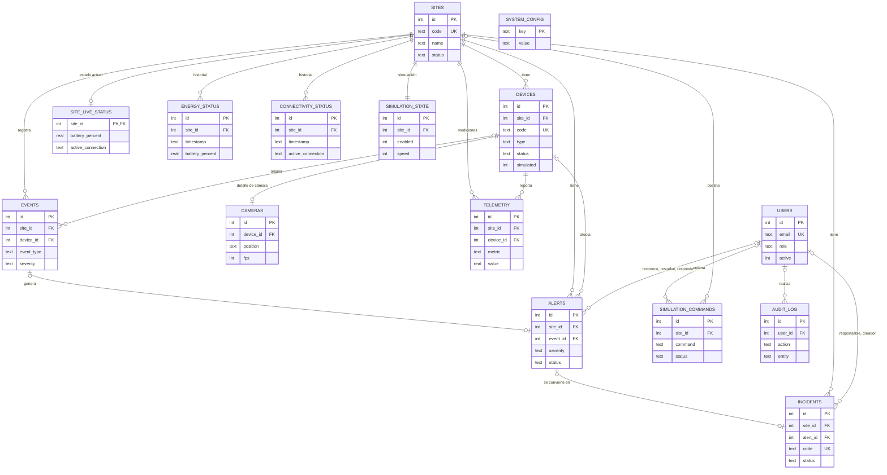

Relaciones de §39 y dónde se implementan:

| Relación | Implementación |
|---|---|
| Una obra tiene varios dispositivos | `devices.site_id` |
| Una obra tiene cámaras | Por medio de sus dispositivos de tipo `CAMERA` |
| Una obra tiene eventos, alertas e incidencias | `events.site_id`, `alerts.site_id`, `incidents.site_id` |
| Un dispositivo pertenece a una obra | `devices.site_id NOT NULL` |
| Una cámara pertenece a un dispositivo | `cameras.device_id UNIQUE` |
| Un evento puede generar una alerta | `alerts.event_id` |
| Una alerta puede generar una incidencia | `incidents.alert_id UNIQUE` (como máximo una) |
| Un usuario reconoce y resuelve alertas | `alerts.acknowledged_by`, `alerts.resolved_by` |
| Un usuario es responsable de incidencias | `incidents.assigned_to` |

### 4.3 Tablas

Las 12 tablas de §38 más 3 adicionales: `site_live_status` (estado actual), `simulation_commands` (órdenes del laboratorio) y `system_config` (parámetros de §43).

#### users

| Columna | Tipo | Reglas | Descripción |
|---|---|---|---|
| id | INTEGER | PK | |
| name | TEXT | NOT NULL | Nombre visible |
| email | TEXT | NOT NULL, UNIQUE | Usuario de ingreso |
| password_hash | TEXT | NOT NULL | Hash BCrypt |
| role | TEXT | ADMINISTRADOR, SUPERVISOR u OPERADOR | |
| active | INTEGER | 0/1, por defecto 1 | Los usuarios se desactivan, no se borran |
| created_at | TEXT | NOT NULL | |
| last_login_at | TEXT | NULL, adicional | Último ingreso |

#### sites

| Columna | Tipo | Reglas | Descripción |
|---|---|---|---|
| id | INTEGER | PK | |
| code | TEXT | NOT NULL, UNIQUE | `OBRA-001` |
| name | TEXT | NOT NULL | |
| client | TEXT | NOT NULL | |
| location | TEXT | NOT NULL | Lima, Callao, Lurín |
| status | TEXT | ACTIVA, MANTENIMIENTO o SIN_CONEXION | El administrador fija ACTIVA o MANTENIMIENTO. Java fija SIN_CONEXION cuando caen Starlink y 4G, y vuelve a ACTIVA al recuperar un enlace (salvo que la obra esté en mantenimiento) |
| installation_date | TEXT | NOT NULL, `YYYY-MM-DD` | |
| created_at | TEXT | NOT NULL | |

#### devices

| Columna | Tipo | Reglas | Descripción |
|---|---|---|---|
| id | INTEGER | PK | |
| site_id | INTEGER | FK sites, NOT NULL | |
| code | TEXT | NOT NULL, UNIQUE | `CAM-001`, `SOL-001`, `BAT-001`, `STL-001`, `LTE-001` |
| name | TEXT | NOT NULL | "Acceso principal", "Antena Starlink" |
| type | TEXT | CAMERA, SOLAR_PANEL, BATTERY, STARLINK o CELLULAR_4G | |
| status | TEXT | ONLINE, OFFLINE, MANTENIMIENTO o FALLA | FALLA se usa para el panel solar |
| simulated | INTEGER | 0/1, por defecto 1 | La interfaz muestra "SIMULADO" |
| last_seen | TEXT | NULL, adicional | Última comunicación en línea |
| created_at | TEXT | NOT NULL | |

#### cameras

| Columna | Tipo | Reglas | Descripción |
|---|---|---|---|
| id | INTEGER | PK | |
| device_id | INTEGER | FK devices, NOT NULL, UNIQUE | |
| position | TEXT | NOT NULL | Ubicación física: "Cerco perimétrico, lado norte" |
| resolution | TEXT | NOT NULL | `1920x1080` |
| fps | INTEGER | NOT NULL | FPS reportados; 0 fuera de línea |
| motion_detection | INTEGER | 0/1 | Detección de movimiento habilitada |
| recording | INTEGER | 0/1 | Indicador REC |
| signal_percent | INTEGER | 0-100, adicional | Calidad de señal |
| motion_active | INTEGER | 0/1, adicional | Movimiento en curso |
| last_motion_at | TEXT | NULL, adicional | |
| scene | TEXT | NOT NULL, adicional | Imagen de fondo CCTV: acceso, perimetro, materiales, vehicular, grua, maquinaria |

#### site_live_status (adicional: estado actual, una fila por obra)

| Columna | Tipo | Descripción |
|---|---|---|
| site_id | INTEGER | PK y FK sites |
| updated_at | TEXT | Última telemetría recibida. Si pasa más de 60 s, la interfaz muestra "Sin datos recientes" |
| device_time | TEXT | Hora del equipo; en la simulación, el reloj virtual |
| battery_percent, battery_voltage | REAL | %, V |
| battery_level | TEXT | NORMAL, BAJA o CRITICA, calculado con histéresis (sección 5.7) |
| battery_trend | TEXT | CARGANDO, DESCARGANDO o ESTABLE |
| solar_status | TEXT | ONLINE o FALLA |
| solar_rated_power, solar_generation | REAL | Potencia nominal simulada y generación actual, en W |
| solar_energy_today | REAL | kWh generados en el día virtual |
| low_generation | INTEGER | 0/1, generación baja informada por el controlador de carga |
| consumption, consumption_cameras, consumption_connectivity, consumption_control | REAL | Consumo total y desglosado, en W |
| estimated_autonomy | REAL | Horas |
| starlink_status | TEXT | ONLINE u OFFLINE |
| starlink_latency, starlink_download, starlink_upload, starlink_packet_loss | REAL | ms, Mbps, Mbps, % |
| cellular_status | TEXT | ONLINE u OFFLINE (ONLINE en espera también cuenta como disponible) |
| cellular_signal | INTEGER | % |
| cellular_latency, cellular_download, cellular_upload | REAL | ms, Mbps, Mbps |
| active_connection | TEXT | STARLINK, CELLULAR_4G o NONE |
| last_history_at | TEXT | Último registro de historial, para respetar la frecuencia de telemetría |

#### energy_status (historial)

| Columna | Tipo | Descripción |
|---|---|---|
| id | INTEGER | PK |
| site_id | INTEGER | FK sites |
| timestamp | TEXT | |
| battery_percent | REAL | % |
| battery_voltage | REAL | V |
| solar_generation | REAL | W |
| consumption | REAL | W |
| estimated_autonomy | REAL | Horas |

#### connectivity_status (historial)

| Columna | Tipo | Descripción |
|---|---|---|
| id | INTEGER | PK |
| site_id | INTEGER | FK sites |
| timestamp | TEXT | |
| starlink_status | TEXT | ONLINE u OFFLINE |
| starlink_latency | REAL NULL | ms (NULL si está caído) |
| starlink_download | REAL NULL | Mbps |
| starlink_upload | REAL NULL | Mbps |
| starlink_packet_loss | REAL NULL | % |
| cellular_status | TEXT | ONLINE u OFFLINE |
| cellular_signal | INTEGER NULL | % |
| cellular_latency | REAL NULL | ms |
| cellular_download | REAL NULL | Mbps, adicional |
| cellular_upload | REAL NULL | Mbps, adicional |
| active_connection | TEXT | STARLINK, CELLULAR_4G o NONE |

#### events

| Columna | Tipo | Descripción |
|---|---|---|
| id | INTEGER | PK |
| site_id | INTEGER | FK sites, NOT NULL |
| device_id | INTEGER | FK devices, NULL si el evento es de la obra |
| timestamp | TEXT | |
| event_type | TEXT | Catálogo de la sección 4.5 |
| severity | TEXT | INFO, BAJA, MEDIA, ALTA o CRITICA |
| description | TEXT | Texto en español |

#### alerts

| Columna | Tipo | Descripción |
|---|---|---|
| id | INTEGER | PK |
| site_id | INTEGER | FK sites |
| device_id | INTEGER | FK devices, NULL |
| event_id | INTEGER | FK events, NULL; evento que la originó |
| alert_type | TEXT | Adicional. Condición que representa: INTRUSION, CAMERA_OFFLINE, BATTERY_LOW, BATTERY_CRITICAL, STARLINK, CONNECTIVITY o SOLAR_PANEL. Sirve para no duplicar alertas y para resolverlas solas |
| created_at | TEXT | |
| severity | TEXT | MEDIA, ALTA o CRITICA en la práctica |
| status | TEXT | NUEVA, RECONOCIDA, EN_ATENCION o RESUELTA |
| title | TEXT | "Intrusión detectada – Perímetro norte" |
| description | TEXT | |
| responsible_id | INTEGER | FK users, NULL, adicional. Responsable actual: quien la reconoció o el responsable de su incidencia |
| acknowledged_by | INTEGER | FK users, NULL |
| acknowledged_at | TEXT | NULL |
| resolved_by | INTEGER | FK users, NULL; queda NULL si la resolvió el sistema |
| resolved_at | TEXT | NULL |
| resolution_note | TEXT | NULL, adicional. Nota del usuario o "Resuelta automáticamente: ..." |

#### incidents

| Columna | Tipo | Descripción |
|---|---|---|
| id | INTEGER | PK |
| site_id | INTEGER | FK sites |
| alert_id | INTEGER | FK alerts, NULL, UNIQUE |
| code | TEXT | UNIQUE, `INC-2026-0001` |
| title | TEXT | |
| description | TEXT | |
| priority | TEXT | BAJA, MEDIA, ALTA o CRITICA |
| status | TEXT | ABIERTA, EN_PROCESO, RESUELTA o CERRADA |
| assigned_to | INTEGER | FK users, NULL; responsable |
| created_by | INTEGER | FK users, NULL, adicional |
| created_at | TEXT | Fecha de apertura |
| updated_at | TEXT | NULL, adicional |
| resolved_at | TEXT | NULL |
| closed_at | TEXT | NULL |
| observations | TEXT | NULL |

#### telemetry

| Columna | Tipo | Descripción |
|---|---|---|
| id | INTEGER | PK |
| site_id | INTEGER | FK sites |
| device_id | INTEGER | FK devices |
| timestamp | TEXT | |
| metric | TEXT | Nombre de la métrica |
| value | REAL | |
| unit | TEXT | %, V, W, ms, estado |

Métricas que se guardan en cada registro:

| Tipo de dispositivo | Métricas |
|---|---|
| BATTERY | `battery_percent` (%), `battery_voltage` (V), `consumption` (W) |
| SOLAR_PANEL | `solar_generation` (W) |
| STARLINK | `online` (1/0), `latency` (ms) |
| CELLULAR_4G | `online` (1/0), `signal` (%) |
| CAMERA | `online` (1/0), `signal` (%) |

#### simulation_state

| Columna | Tipo | Descripción |
|---|---|---|
| id | INTEGER | PK |
| site_id | INTEGER | FK sites, UNIQUE (una fila por obra) |
| enabled | INTEGER | 1 = simulación automática en marcha; 0 = en pausa |
| speed | INTEGER | 1, 5 o 20 |
| scenario | TEXT | Último escenario aplicado (NORMAL, STARLINK_FAILURE, ...) |
| updated_at | TEXT | |

Los controles Pausar, Reanudar y velocidad del laboratorio actúan sobre todas las obras a la vez. Guardarlos por obra deja abierta la posibilidad de controlarlas por separado más adelante.

#### simulation_commands (adicional)

| Columna | Tipo | Descripción |
|---|---|---|
| id | INTEGER | PK |
| site_id | INTEGER | FK sites, NULL para órdenes globales (RESET) |
| device_id | INTEGER | FK devices, NULL; cámara elegida |
| command | TEXT | Catálogo `Scenario` (sección 5.8) |
| status | TEXT | PENDIENTE, ENVIADO, EJECUTADO, ERROR o EXPIRADO |
| created_by | INTEGER | FK users |
| created_at, sent_at, executed_at | TEXT | |
| result | TEXT | Mensaje que devuelve el simulador |

#### system_config (adicional)

| Columna | Tipo | Descripción |
|---|---|---|
| key | TEXT | PK |
| value | TEXT | |
| description | TEXT | Texto de ayuda de la pantalla Configuración |
| updated_at | TEXT | |
| updated_by | INTEGER | FK users, NULL |

| Clave | Por defecto | Rango | Efecto |
|---|---|---|---|
| `battery.low_threshold` | 35 | 5-90 | Batería baja (%) |
| `battery.critical_threshold` | 20 | 1-89, menor que el anterior | Batería crítica (%) |
| `ui.refresh_seconds` | 5 | 2-60 | Frecuencia de actualización de pantallas |
| `telemetry.interval_seconds` | 60 | 10-600 | Frecuencia de registro de historial |
| `simulation.enabled` | true | true/false | Simulación automática activada. Se aplica al guardar y al reiniciar |
| `simulation.default_speed` | 1 | 1, 5 o 20 | Velocidad al iniciar o reiniciar la simulación |

#### audit_log

| Columna | Tipo | Descripción |
|---|---|---|
| id | INTEGER | PK |
| user_id | INTEGER | FK users, NULL para acciones del sistema o login fallido |
| action | TEXT | LOGIN, LOGIN_FALLIDO, LOGOUT, USUARIO_CREADO, USUARIO_ACTUALIZADO, OBRA_CREADA, OBRA_ACTUALIZADA, DISPOSITIVO_CREADO, DISPOSITIVO_ACTUALIZADO, ALERTA_RECONOCIDA, ALERTA_RESUELTA, INCIDENCIA_CREADA, INCIDENCIA_ACTUALIZADA, INCIDENCIA_CERRADA, ESCENARIO_EJECUTADO, SIMULACION_CONTROL, CONFIGURACION_ACTUALIZADA, REPORTE_EXPORTADO |
| entity | TEXT | SESSION, USER, SITE, DEVICE, ALERT, INCIDENT, SIMULATION, CONFIG, REPORT |
| entity_id | INTEGER | NULL |
| details | TEXT | Descripción legible del cambio |
| timestamp | TEXT | |

### 4.4 Índices

| Tabla | Índice | Para qué |
|---|---|---|
| devices | `(site_id)` | Inventario por obra |
| energy_status | `(site_id, timestamp)` | Gráficos y reportes de energía |
| connectivity_status | `(site_id, timestamp)` | Gráficos y reportes de conectividad |
| telemetry | `(device_id, metric, timestamp)` y `(site_id, timestamp)` | Pestaña Telemetría y reporte de disponibilidad |
| events | `(site_id, timestamp)` y `(timestamp)` | Historial por obra y global |
| alerts | `(status)`, `(site_id, status)`, `(created_at)` | Alertas activas, estado general, gráfico de 24 h |
| incidents | `(status)`, `(site_id)` | Listados |
| simulation_commands | `(status, created_at)` | Órdenes pendientes |
| audit_log | `(timestamp)` | Pantalla de auditoría |

### 4.5 Catálogos

| Catálogo | Valores |
|---|---|
| Rol | ADMINISTRADOR, SUPERVISOR, OPERADOR |
| Estado de obra | ACTIVA, MANTENIMIENTO, SIN_CONEXION |
| Tipo de dispositivo | CAMERA, SOLAR_PANEL, BATTERY, STARLINK, CELLULAR_4G |
| Estado de dispositivo | ONLINE, OFFLINE, MANTENIMIENTO, FALLA |
| Severidad (§28) | INFO, BAJA, MEDIA, ALTA, CRITICA |
| Estado de alerta (§30) | NUEVA, RECONOCIDA, EN_ATENCION, RESUELTA |
| Estado de incidencia (§31) | ABIERTA, EN_PROCESO, RESUELTA, CERRADA |
| Prioridad de incidencia | BAJA, MEDIA, ALTA, CRITICA |
| Conexión | STARLINK, CELLULAR_4G, NONE |
| Estado general (§17) | NORMAL (OPERACIÓN NORMAL), ADVERTENCIA, CRITICO (ESTADO CRÍTICO) |
| Nivel de batería | NORMAL, BAJA, CRITICA |
| Estado de orden | PENDIENTE, ENVIADO, EJECUTADO, ERROR, EXPIRADO |

Tipos de evento. Los 13 de §27 más tres necesarios para la contingencia (CELLULAR_DOWN, CELLULAR_RESTORED, CONNECTIVITY_LOST):

| Código | Texto en pantalla | Severidad | ¿Genera alerta? | Quién lo detecta |
|---|---|---|---|---|
| MOTION_DETECTED | Movimiento detectado | INFO | No | El equipo lo informa (cámara) |
| INTRUSION_DETECTED | Intrusión detectada | ALTA en horario laboral, CRITICA fuera de él | Sí | El equipo lo informa (cámara) |
| CAMERA_OFFLINE | Cámara desconectada | ALTA | Sí | Java, por cambio de estado |
| CAMERA_RESTORED | Cámara recuperada | INFO | No; resuelve la alerta de la cámara | Java |
| BATTERY_LOW | Batería baja | MEDIA | Sí | Java, por umbral |
| BATTERY_CRITICAL | Batería crítica | ALTA | Sí | Java, por umbral |
| STARLINK_DOWN | Starlink desconectado ("Conexión Starlink perdida") | MEDIA | Sí, si el 4G está disponible | Java |
| STARLINK_RESTORED | Starlink recuperado | INFO | No; resuelve la alerta de Starlink | Java |
| CELLULAR_ACTIVATED | 4G activado ("Activando respaldo 4G" y "Conexión restablecida mediante 4G") | BAJA | No | Java, al aplicar la contingencia |
| CELLULAR_DOWN | 4G desconectado | BAJA | No | Java |
| CELLULAR_RESTORED | 4G recuperado | INFO | No | Java |
| CONNECTIVITY_LOST | Obra sin conectividad (Starlink y 4G caídos) | CRITICA | Sí | Java |
| LOW_SOLAR_GENERATION | Baja generación solar | BAJA | No | Java, por la bandera `lowGeneration` |
| SOLAR_PANEL_FAILURE | Falla panel solar | MEDIA | Sí | Java, por cambio de estado |
| DEVICE_MAINTENANCE | Dispositivo en mantenimiento | INFO | No | Java, por acción del administrador |
| SYSTEM_RESTORED | Sistema restaurado | INFO | No; resuelve alertas de condición | Java (batería, panel, generación o comunicación normalizados) |

### 4.6 Volumen de datos y retención

| Tabla | Cuándo se escribe | Filas por día (4 obras) | Se conserva |
|---|---|---|---|
| site_live_status | Cada 5 s (se actualiza, no crece) | 4 filas en total | Siempre |
| energy_status | Cada 60 s y en cada cambio de estado | ≈ 5 800 | 30 días |
| connectivity_status | Cada 60 s y en cada cambio de estado | ≈ 5 800 | 30 días |
| telemetry | Cada 60 s y en cada cambio, 56 métricas por registro | ≈ 81 000 | 7 días |
| events, alerts, incidents, audit_log | Cuando ocurren | Decenas | Siempre |

Una tarea programada en `TelemetryService` borra lo que supera la retención al iniciar y luego cada 6 horas. Los gráficos de 24 h piden a Java series ya agrupadas (un punto cada 5 minutos como máximo), para no mandar miles de puntos al navegador.

### 4.7 Datos iniciales

`DataSeeder` los carga en el primer arranque, o con `install.bat` y `reset_demo.bat`. Todo es demostrativo (§16).

Usuarios (§11):

| Nombre | Correo | Contraseña | Rol |
|---|---|---|---|
| Administrador del Sistema | admin@novatech.local | Admin123* | ADMINISTRADOR |
| Supervisor de Monitoreo | supervisor@novatech.local | Supervisor123* | SUPERVISOR |
| Operador de Centro de Control | operador@novatech.local | Operador123* | OPERADOR |

Obras (§16):

| Código | Nombre | Cliente | Ubicación | Cámaras |
|---|---|---|---|---|
| OBRA-001 | Edificio Empresarial San Isidro | Constructora Andina | Lima | 4 |
| OBRA-002 | Proyecto Residencial Miraflores | Inmobiliaria Horizonte | Lima | 3 |
| OBRA-003 | Centro Logístico Callao | Logística del Pacífico | Callao | 3 |
| OBRA-004 | Proyecto Industrial Lurín | Ingeniería Sur | Lurín | 2 |

Cámaras (§20). Doce en total, lo que da el ejemplo "11 / 12" de §14 cuando una cae:

| Código | Obra | Nombre | Ubicación | Resolución | Escena |
|---|---|---|---|---|---|
| CAM-001 | OBRA-001 | Acceso principal | Portón peatonal de ingreso | 1920x1080 | acceso |
| CAM-002 | OBRA-001 | Perímetro norte | Cerco perimétrico, lado norte | 1920x1080 | perimetro |
| CAM-003 | OBRA-001 | Zona de materiales | Patio de acopio de fierro y agregados | 1920x1080 | materiales |
| CAM-004 | OBRA-001 | Acceso vehicular | Portón de ingreso de camiones | 2560x1440 | vehicular |
| CAM-005 | OBRA-002 | Acceso principal | Caseta de control de ingreso | 1920x1080 | acceso |
| CAM-006 | OBRA-002 | Perímetro sur | Cerco perimétrico, lado sur | 1920x1080 | perimetro |
| CAM-007 | OBRA-002 | Grúa torre | Base de la grúa torre y losa en construcción | 2560x1440 | grua |
| CAM-008 | OBRA-003 | Patio de maniobras | Patio de maniobras de camiones | 2560x1440 | vehicular |
| CAM-009 | OBRA-003 | Almacén de materiales | Almacén temporal y contenedores | 1920x1080 | materiales |
| CAM-010 | OBRA-003 | Perímetro este | Cerco perimétrico, lado este | 1920x1080 | perimetro |
| CAM-011 | OBRA-004 | Acceso vehicular | Portón de ingreso principal | 1920x1080 | acceso |
| CAM-012 | OBRA-004 | Zona de maquinaria | Estacionamiento de maquinaria pesada | 1920x1080 | maquinaria |

Cuando dos cámaras comparten escena, la segunda se muestra espejada para que no se vean idénticas.

Cada obra tiene además cuatro equipos con el número de la obra: `SOL-00N` (panel solar), `BAT-00N` (banco de baterías), `STL-00N` (antena Starlink) y `LTE-00N` (módem 4G de respaldo). En total son 28 dispositivos.

Historia coherente (§46):

- 24 horas de `energy_status`, `connectivity_status` y `telemetry` con un punto cada 5 minutos (288 por obra y tabla, unas 16 000 filas de telemetría).
- La historia se genera con el mismo modelo que usa Python (sección 5.8): la generación solar sigue la hora del día, la batería se integra paso a paso a partir de generación y consumo, y la latencia varía poco entre puntos. Un generador aleatorio con semilla fija hace que cada instalación produzca los mismos datos.
- Episodios registrados, cada uno con sus eventos y con la historia que le corresponde:

| Obra | Episodio | Qué queda registrado |
|---|---|---|
| OBRA-001 | Intrusión en Perímetro norte (CAM-002) | Evento y alerta con la severidad que dé la regla según la hora; reconocida por el operador; incidencia creada y resuelta por el supervisor, luego CERRADA |
| OBRA-002 | CAM-006 fuera de línea 40 minutos | Alerta ALTA reconocida; incidencia RESUELTA ("conector de red reasentado"); telemetría `online = 0` durante el corte |
| OBRA-002 | Intrusión en Grúa torre | Resuelta por el supervisor como falsa alarma (personal de la obra en zona restringida) |
| OBRA-003 | Starlink caído 25 minutos | Eventos de la contingencia; conexión 4G en el historial de conectividad durante el corte; alerta MEDIA resuelta sola; incidencia EN_PROCESO de seguimiento |
| OBRA-004 | Dos horas nubladas en horario de sol | LOW_SOLAR_GENERATION y SYSTEM_RESTORED; generación reducida en el historial de energía |
| OBRA-004 | CAM-011 fuera de línea 15 minutos | Alerta ALTA resuelta sola al volver la cámara, sin intervención humana |

- Dos alertas y una incidencia de días anteriores (ya cerradas), para que los reportes de 7 días tengan contenido.
- Unos 25 eventos en las últimas 24 horas, incluidos movimientos rutinarios.
- Los episodios se ubican en momentos relativos a la hora de carga y la severidad se calcula con `MonitoringRules`, así la historia es coherente sin importar a qué hora se instale. El episodio nublado busca siempre un tramo de horas de sol.
- Estado final: todas las alertas RESUELTAS, todas las cámaras en línea, Starlink activo en las cuatro obras y baterías en rango normal. Las cuatro obras empiezan en OPERACIÓN NORMAL (§56, paso 5).
- Registros de auditoría que corresponden a las acciones anteriores (ingresos, reconocimientos, incidencias).

Si la base se crea con `install.bat` y la demostración es días después, los gráficos de 24 h mostrarán solo lo que el sistema haya registrado en ese período, que será poco o nada si estuvo apagado. Para volver a tener 24 h de historia recién generada basta con `reset_demo.bat`; el README lo indicará.

---

## 5. Flujo de información

### 5.1 Ciclo normal

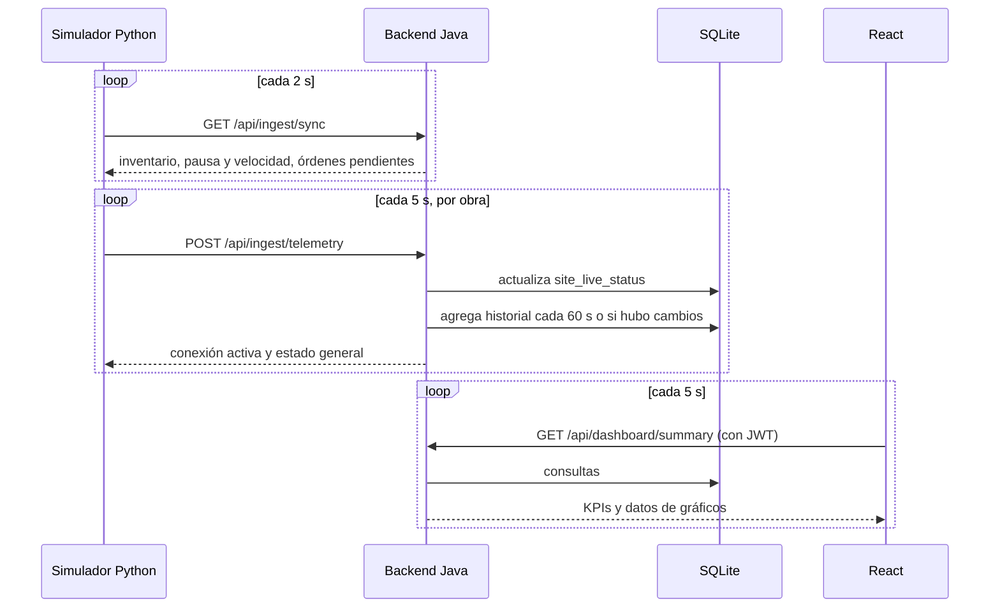

Una orden del laboratorio se ve en pantalla en 5 a 8 segundos: hasta 2 s para que Python la recoja, un envío inmediato de telemetría o evento y hasta 5 s para el siguiente refresco del navegador.

### 5.2 Login y permisos

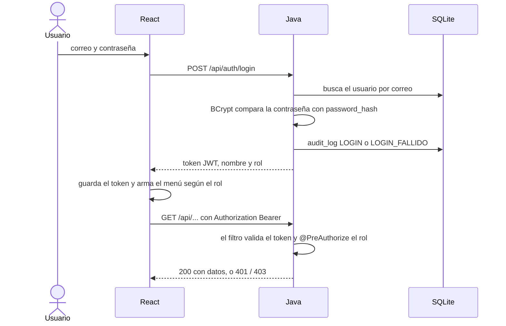

### 5.3 Qué hace Java con cada telemetría

`IngestService` procesa cada paquete en una transacción:

1. `DeviceKeyFilter` ya validó la clave del equipo.
2. Se valida el JSON: campos obligatorios, porcentajes entre 0 y 100, estados permitidos.
3. Se busca la obra por `siteCode` y cada equipo por su código. Un código desconocido se ignora y queda registrado en la consola de Java.
4. Se lee el estado anterior (`site_live_status` y `devices.status`).
5. Cámaras: se compara el estado. MANTENIMIENTO lo controla el administrador: la telemetría no puede poner ni sacar una cámara de mantenimiento. Se actualizan FPS, señal, movimiento y última comunicación.
6. Energía: se calcula el nivel de batería con los umbrales configurados y la histéresis, y se revisan la falla del panel y la baja generación.
7. Conectividad: la tabla de contingencia decide la conexión activa.
8. Por cada cambio se registra un evento y, si `MonitoringRules` lo indica, se crea o se resuelve la alerta correspondiente.
9. Se actualizan `site_live_status` y el estado de la obra (SIN_CONEXION o ACTIVA).
10. Si pasó la frecuencia de telemetría, o si en el paso 8 hubo cambios, se agregan filas a `energy_status`, `connectivity_status` y `telemetry`.
11. Se responde con la conexión activa, el estado general y la cantidad de eventos y alertas creados.

### 5.4 Escenario del laboratorio: intrusión

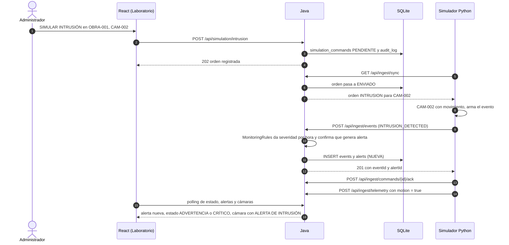

La marca "ALERTA DE INTRUSIÓN" de la cámara se mantiene mientras su alerta de intrusión no esté resuelta. "MOVIMIENTO DETECTADO" dura 30 segundos reales.

### 5.5 Contingencia Starlink → 4G (§26)

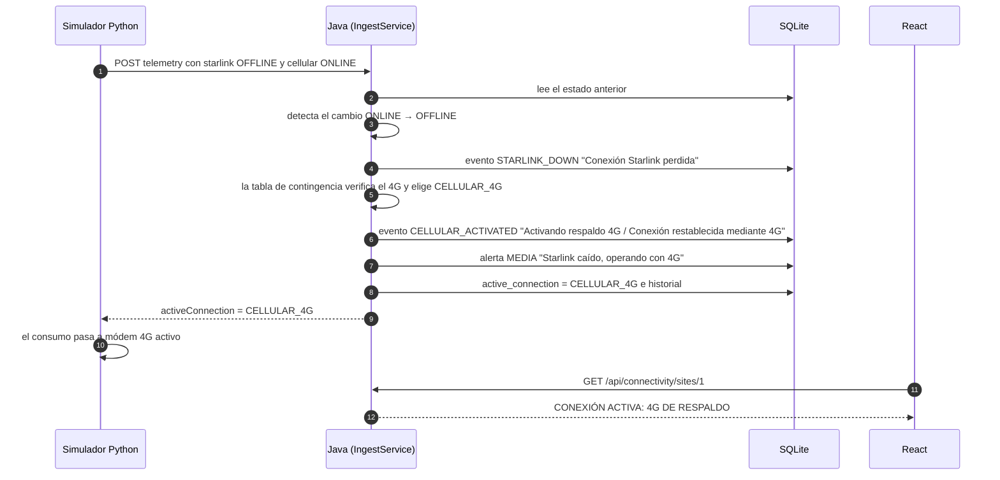

Cuando Starlink vuelve: evento STARLINK_RESTORED, conexión activa STARLINK, alerta resuelta automáticamente y el dashboard lo refleja en el siguiente refresco.

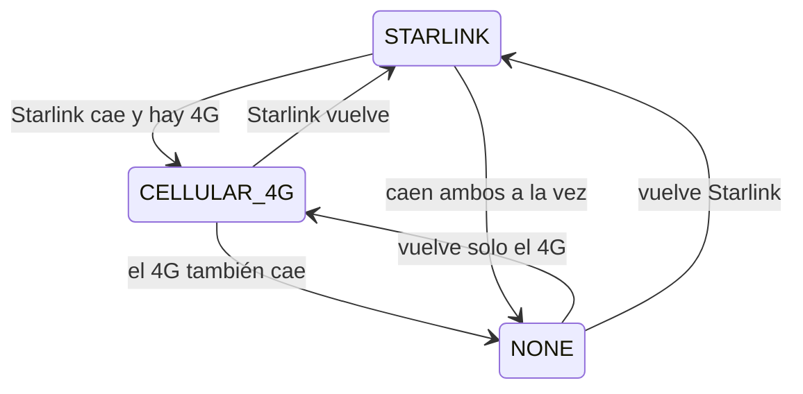

### 5.6 Ciclo de vida de alertas e incidencias

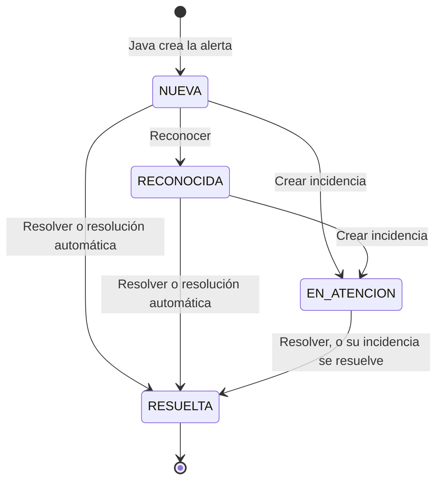

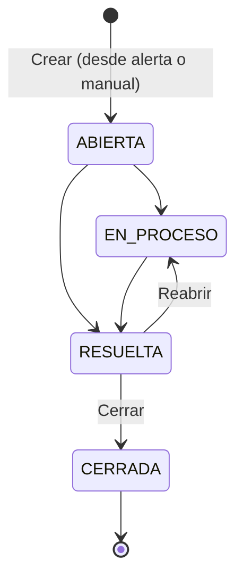

Cada acción guarda usuario y fecha (§30): `acknowledged_by/at`, `resolved_by/at`, `assigned_to`, `resolved_at`, `closed_at`, y una fila en `audit_log`. Al crear la incidencia desde una alerta, la alerta pasa a EN_ATENCION y su responsable es el de la incidencia. Al resolverse la incidencia, se resuelve su alerta.

### 5.7 Reglas de negocio centralizadas (`MonitoringRules`)

Estado general de una obra (§18), calculado con sus alertas no resueltas:

| Alertas activas | Estado general |
|---|---|
| Ninguna, o solo INFO o BAJA | OPERACIÓN NORMAL |
| Al menos una MEDIA o ALTA y ninguna CRÍTICA | ADVERTENCIA |
| Al menos una CRÍTICA | ESTADO CRÍTICO |

El estado general de la plataforma, en la cabecera, es el peor entre las obras.

Alertas (§29). Cada condición anormal tiene como máximo una alerta activa: se crea cuando la condición aparece y Java la resuelve sola cuando desaparece, con la nota "Resuelta automáticamente". Las intrusiones son la excepción: cada una crea una alerta nueva y solo una persona puede resolverla.

| Condición | Severidad | Se resuelve |
|---|---|---|
| Intrusión entre 07:00 y 17:59 (hora del equipo) | ALTA | Solo una persona |
| Intrusión entre 18:00 y 06:59 | CRÍTICA | Solo una persona |
| Cámara OFFLINE | ALTA | Sola, al volver a ONLINE |
| Batería en nivel BAJA | MEDIA | Sola, al salir de ese nivel |
| Batería en nivel CRÍTICA | ALTA | Sola, al salir de ese nivel |
| Starlink caído con 4G disponible | MEDIA | Sola, al volver Starlink o si pasa a sin conectividad |
| Starlink y 4G caídos | CRÍTICA | Sola, al volver cualquiera de los dos |
| Panel solar en FALLA | MEDIA | Sola, al volver a ONLINE |

Si una persona resuelve una alerta de condición mientras la condición sigue (por ejemplo, Starlink aún caído), no se vuelve a crear hasta que la condición desaparezca y aparezca otra vez.

Nivel de batería con histéresis. Los umbrales vienen de `system_config`; el margen de 5 puntos está en `MonitoringRules` y evita que una batería que oscila entre 34,9 % y 35,1 % dispare alertas en cadena.

| Nivel actual | Pasa a | Cuando |
|---|---|---|
| NORMAL | BAJA | batería ≤ 35 % |
| NORMAL o BAJA | CRÍTICA | batería ≤ 20 % |
| CRÍTICA | BAJA | batería ≥ 25 % (crítico + 5) |
| BAJA | NORMAL | batería ≥ 40 % (bajo + 5) |

Tabla de contingencia (§26):

| Starlink | 4G | Conexión activa | Eventos | Alerta activa |
|---|---|---|---|---|
| ONLINE | cualquiera | STARLINK | STARLINK_RESTORED si venía caído | Ninguna de conectividad |
| OFFLINE | ONLINE | CELLULAR_4G | STARLINK_DOWN y CELLULAR_ACTIVATED | STARLINK (MEDIA) |
| OFFLINE | OFFLINE | NONE | CONNECTIVITY_LOST, más STARLINK_DOWN o CELLULAR_DOWN por cada enlace que cayó | CONNECTIVITY (CRÍTICA); la obra pasa a SIN_CONEXION |

Con equipos reales, cuando fallan los dos enlaces la estación no puede avisar y la plataforma lo notaría por falta de datos. En la simulación, Python informa explícitamente ambos enlaces caídos para que la demostración sea inmediata. Aparte, si una obra deja de enviar datos por más de 60 segundos, la interfaz la marca "Sin datos recientes" sin generar alertas: así, si el simulador está apagado, no se llena la pantalla de alertas críticas.

### 5.8 Modelo de simulación

Escenarios del laboratorio (§32):

| Botón | Endpoint | Orden | Qué hace Python | Qué detecta Java |
|---|---|---|---|---|
| OPERACIÓN NORMAL | `/restore-normal` | RESTORE_NORMAL | Todo en línea (salvo cámaras en mantenimiento), energía normal, batería al menos 85 % | Recuperaciones: eventos y resolución de alertas de condición |
| DETECTAR MOVIMIENTO | `/motion` | MOTION | Movimiento de 30 s en la cámara elegida, o una al azar | MOTION_DETECTED (INFO) |
| SIMULAR INTRUSIÓN | `/intrusion` | INTRUSION | Movimiento y evento de intrusión | INTRUSION_DETECTED y alerta ALTA o CRÍTICA |
| DESCONECTAR CÁMARA | `/camera-failure` | CAMERA_FAILURE | Cámara OFFLINE | CAMERA_OFFLINE y alerta ALTA |
| RECUPERAR CÁMARA | `/camera-restore` | CAMERA_RESTORE | Cámara ONLINE (la elegida, o todas las caídas) | CAMERA_RESTORED y alerta resuelta |
| FALLA STARLINK | `/starlink-failure` | STARLINK_FAILURE | Starlink OFFLINE | Contingencia a 4G y alerta MEDIA |
| RESTAURAR STARLINK | `/starlink-restore` | STARLINK_RESTORE | Starlink ONLINE | Vuelta a Starlink y alerta resuelta |
| FALLA STARLINK + 4G | `/network-failure` | NETWORK_FAILURE | Starlink y 4G OFFLINE | CONNECTIVITY_LOST, alerta CRÍTICA, obra SIN_CONEXION |
| BATERÍA BAJA | `/low-battery` | LOW_BATTERY | Batería a 30 % aproximadamente | BATTERY_LOW y alerta MEDIA |
| BATERÍA CRÍTICA | `/critical-battery` | CRITICAL_BATTERY | Batería a 15 % aproximadamente | BATTERY_CRITICAL y alerta ALTA |
| DÍA NUBLADO | `/cloudy-day` | CLOUDY_DAY | Generación × 0,25 | LOW_SOLAR_GENERATION (BAJA) |
| FALLA PANEL SOLAR | `/solar-failure` | SOLAR_FAILURE | Panel en FALLA, generación 0 | SOLAR_PANEL_FAILURE y alerta MEDIA |
| RESTAURAR ENERGÍA | `/restore-energy` | RESTORE_ENERGY | Panel normal, sin nubes, batería al menos 85 % | SYSTEM_RESTORED y alertas de energía resueltas |
| Pausar / Reanudar | `/pause`, `/start` | (estado) | Congela o reanuda el reloj virtual | Nada; la telemetría sigue llegando con valores fijos |
| x1 / x5 / x20 | `/speed` | (estado) | Cambia la velocidad del reloj virtual | Nada |
| Reiniciar | `/reset` | RESET | Todo normal, batería inicial, reloj en la hora real, velocidad y pausa según Configuración | Recuperaciones |

Reloj virtual y simulación automática (§23, §33, §34):

- Cada obra tiene un reloj virtual. Arranca en la hora real y avanza `segundos reales × velocidad` (x1, x5 o x20). A x20 un día simulado dura 72 minutos.
- La velocidad afecta al tiempo simulado (sol, batería, variaciones). Los intervalos de envío (2 s y 5 s) son siempre reales.
- En marcha, cada paso recalcula la generación solar según la hora virtual, el consumo y la batería, y aplica variaciones pequeñas y acotadas a latencia, velocidades, pérdida de paquetes, señal del 4G, señal de las cámaras y FPS. En horario laboral puede aparecer movimiento ocasional, con baja probabilidad. Las fallas graves solo ocurren por orden del laboratorio.
- En pausa, el reloj se detiene y los valores quedan fijos, pero la telemetría se sigue enviando y las órdenes del laboratorio se siguen aplicando.
- Si el simulador se reinicia, toma de Java la última batería conocida y la energía del día, así el gráfico no salta. Los equipos arrancan en línea, como después de un reinicio.

Fórmulas:

- Generación solar: `G = Pnominal × sen(π × (h − 6) / 12)` entre las 6:00 y las 18:00 virtuales, y 0 fuera de ese rango (madrugada y noche en 0, máximo al mediodía). Se multiplica por un factor aleatorio entre 0,92 y 1,03; por 0,25 en día nublado; por 0 con el panel en falla.
- Batería (§24): `energía nueva = energía actual + (generación − consumo) × horas del paso`, con la carga limitada a una potencia máxima. Luego `batería % = energía / capacidad × 100`, siempre entre 0 y 100.
- Autonomía: `energía almacenada / consumo actual`, en horas.
- Voltaje: lineal entre 22,0 V (0 %) y 27,2 V (100 %).
- Variaciones: `valor nuevo = valor + aleatorio(−paso, +paso)`, recortado a su rango, para que dos registros seguidos nunca difieran de forma absurda (§46).

Valores por defecto en `config.py`. Son demostrativos y no describen productos comerciales (§57):

| Parámetro | Valor |
|---|---|
| Potencia nominal del panel | 800 W (OBRA-004: 600 W) |
| Capacidad de la batería | 5 000 Wh (OBRA-003: 6 000 Wh; OBRA-004: 3 500 Wh) |
| Potencia máxima de carga | 400 W |
| Consumo por cámara | 7 W de día, 9 W de noche (iluminación infrarroja) |
| Consumo de Starlink | 45 W en línea, 15 W buscando señal |
| Consumo del módem 4G | 6 W activo, 2 W en espera |
| Consumo del sistema de control | 15 W |
| Starlink | latencia 30-60 ms, bajada 80-220 Mbps, subida 10-30 Mbps, pérdida 0-1,5 % |
| 4G | señal 55-90 %, latencia 45-95 ms, bajada 10-45 Mbps, subida 4-15 Mbps |
| Cámaras | 25 FPS (24-25), señal 75-99 % |
| Día nublado | generación × 0,25 |
| Batería en escenarios | baja 30 %, crítica 15 %, al restaurar al menos 85 % |
| Movimiento visible | 30 s reales |
| Consulta de órdenes y envío de telemetría | cada 2 s y cada 5 s reales |

Con estos valores una estación consume unos 90-100 W. En un día normal el panel repone de sobra lo gastado de noche y la batería se mueve entre 75 % y 100 %, sin alertas. Un día nublado genera menos de lo que se consume y la batería baja cerca de 15 puntos por día simulado. Los escenarios de batería existen para no tener que esperar eso.

### 5.9 Contrato JSON entre Python y Java

Todas las peticiones de Python llevan la cabecera `X-Device-Key`. Las fechas van en formato ISO sin zona (`2026-09-24T14:32:10`).

`POST /api/ingest/telemetry` (una obra por petición):

```json
{
  "siteCode": "OBRA-001",
  "deviceTime": "2026-09-24T14:32:10",
  "cameras": [
    { "code": "CAM-001", "status": "ONLINE", "fps": 25, "signal": 92, "motion": false, "recording": true },
    { "code": "CAM-002", "status": "ONLINE", "fps": 25, "signal": 88, "motion": true, "recording": true }
  ],
  "solarPanel": { "code": "SOL-001", "status": "ONLINE", "ratedPowerW": 800, "generationW": 512.4, "energyTodayKwh": 2.31, "lowGeneration": false },
  "battery": { "code": "BAT-001", "status": "ONLINE", "percent": 86.2, "voltage": 26.5, "autonomyHours": 45.1 },
  "consumption": { "totalW": 94.0, "camerasW": 32.0, "connectivityW": 47.0, "controlW": 15.0 },
  "starlink": { "code": "STL-001", "status": "ONLINE", "latencyMs": 42.0, "downloadMbps": 150.2, "uploadMbps": 18.5, "packetLoss": 0.3 },
  "cellular": { "code": "LTE-001", "status": "ONLINE", "signal": 74, "latencyMs": 68.0, "downloadMbps": 28.1, "uploadMbps": 9.4 }
}
```

Respuesta `200`:

```json
{ "activeConnection": "STARLINK", "generalState": "NORMAL", "eventsCreated": 0, "alertsCreated": 0 }
```

`POST /api/ingest/events`:

```json
{
  "siteCode": "OBRA-001",
  "deviceCode": "CAM-002",
  "type": "INTRUSION_DETECTED",
  "deviceTime": "2026-09-24T22:05:00",
  "description": "Intrusión detectada en Perímetro norte: movimiento en zona restringida"
}
```

Respuesta `201`:

```json
{ "eventId": 812, "severity": "CRITICA", "alertId": 57 }
```

`GET /api/ingest/sync`, respuesta `200`:

```json
{
  "serverTime": "2026-09-24T14:32:12",
  "sites": [
    {
      "code": "OBRA-001",
      "enabled": true,
      "speed": 1,
      "lastKnown": { "batteryPercent": 86.2, "solarEnergyTodayKwh": 2.31 },
      "devices": [
        { "code": "CAM-001", "type": "CAMERA", "name": "Acceso principal", "status": "ONLINE" },
        { "code": "SOL-001", "type": "SOLAR_PANEL", "name": "Panel solar", "status": "ONLINE" },
        { "code": "BAT-001", "type": "BATTERY", "name": "Banco de baterías", "status": "ONLINE" },
        { "code": "STL-001", "type": "STARLINK", "name": "Antena Starlink", "status": "ONLINE" },
        { "code": "LTE-001", "type": "CELLULAR_4G", "name": "Módem 4G de respaldo", "status": "ONLINE" }
      ]
    }
  ],
  "commands": [
    { "id": 31, "siteCode": "OBRA-001", "deviceCode": "CAM-002", "command": "INTRUSION", "createdAt": "2026-09-24T14:32:05" }
  ]
}
```

Si el administrador crea una obra nueva o agrega una cámara, aparece en `sync` y Python empieza a simularla sin reiniciarse.

`POST /api/ingest/commands/{id}/ack`:

```json
{ "success": true, "message": "Intrusión generada en CAM-002 (Perímetro norte)" }
```

---

## 6. Endpoints principales

Todos bajo `http://localhost:8080`. "Todos" significa cualquier usuario con sesión iniciada. Admin = ADMINISTRADOR, Sup = SUPERVISOR.

Autenticación y sistema:

| Método | Ruta | Acceso | Descripción |
|---|---|---|---|
| POST | `/api/auth/login` | Público | Valida credenciales y devuelve token, nombre y rol |
| GET | `/api/auth/me` | Todos | Usuario actual y parámetros de interfaz |
| POST | `/api/auth/logout` | Todos | Registra la salida en auditoría (el token se descarta en el navegador) |
| GET | `/api/health` | Público | Indica que el backend está listo; lo usan los scripts y el simulador |

Usuarios:

| Método | Ruta | Acceso | Descripción |
|---|---|---|---|
| GET | `/api/users` | Admin | Lista |
| POST | `/api/users` | Admin | Crear |
| PUT | `/api/users/{id}` | Admin | Editar nombre, correo, rol, estado y, si se envía, contraseña |
| GET | `/api/users/assignable` | Admin, Sup | Usuarios activos para elegir responsable de una incidencia |

Obras, dispositivos y cámaras:

| Método | Ruta | Acceso | Descripción |
|---|---|---|---|
| GET | `/api/sites?status=&q=` | Todos | Lista con cámaras, batería, conexión activa, alertas activas y estado general |
| GET | `/api/sites/{id}` | Todos | Detalle para el centro de control |
| POST | `/api/sites` | Admin | Crear obra con su estación (indica de 2 a 4 cámaras) |
| PUT | `/api/sites/{id}` | Admin | Editar |
| GET | `/api/devices?siteId=` | Todos | Inventario |
| POST | `/api/devices` | Admin | Agregar cámara a una obra (máximo 4) |
| PUT | `/api/devices/{id}` | Admin | Editar datos; poner o quitar mantenimiento en cámaras |
| GET | `/api/cameras?siteId=` | Todos | Cámaras con estado, movimiento, intrusión activa y último evento |

Energía, conectividad y telemetría:

| Método | Ruta | Acceso | Descripción |
|---|---|---|---|
| GET | `/api/energy` | Todos | Estado energético actual de todas las obras |
| GET | `/api/energy/sites/{siteId}` | Todos | Panel solar, batería y consumo desglosado |
| GET | `/api/energy/sites/{siteId}/history?hours=24` | Todos | Series de batería, generación y consumo |
| GET | `/api/connectivity` | Todos | Conexión activa por obra y totales Starlink, 4G y sin conexión |
| GET | `/api/connectivity/sites/{siteId}` | Todos | Detalle de Starlink y 4G |
| GET | `/api/connectivity/sites/{siteId}/history?hours=24` | Todos | Latencia y conexión activa en el tiempo, con las contingencias |
| GET | `/api/connectivity/sites/{siteId}/timeline` | Todos | Línea de tiempo de contingencias: "Conexión Starlink perdida", "Activando respaldo 4G"... |
| GET | `/api/telemetry?siteId=&deviceId=&metric=&hours=` | Todos | Serie de una métrica de un dispositivo |
| GET | `/api/telemetry/latest?siteId=` | Todos | Últimos registros de telemetría de la obra |
| GET | `/api/telemetry/metrics?siteId=` | Todos | Métricas disponibles de cada dispositivo (para elegir qué graficar) |

Eventos, alertas e incidencias:

| Método | Ruta | Acceso | Descripción |
|---|---|---|---|
| GET | `/api/events?siteId=&type=&severity=&from=&to=&page=&size=` | Todos | Historial paginado |
| GET | `/api/alerts?siteId=&status=&severity=&page=&size=` | Todos | Alertas paginadas |
| GET | `/api/alerts/{id}` | Todos | Detalle |
| PUT | `/api/alerts/{id}/acknowledge` | Todos | NUEVA → RECONOCIDA |
| PUT | `/api/alerts/{id}/resolve` | Admin, Sup | → RESUELTA, con nota |
| GET | `/api/incidents?siteId=&status=&priority=` | Admin, Sup | Lista |
| GET | `/api/incidents/{id}` | Admin, Sup | Detalle |
| POST | `/api/incidents` | Admin, Sup | Crear desde una alerta (`alertId`) o a mano |
| PUT | `/api/incidents/{id}` | Admin, Sup | Editar título, descripción, prioridad, responsable u observaciones |
| PUT | `/api/incidents/{id}/status` | Admin, Sup | Cambiar a EN_PROCESO, RESUELTA o CERRADA |

Dashboard y reportes:

| Método | Ruta | Acceso | Descripción |
|---|---|---|---|
| GET | `/api/dashboard/summary` | Todos | KPIs y datos de los cuatro gráficos en una sola respuesta |
| GET | `/api/dashboard/status` | Todos | Estado general, conteos, estado de la fuente de datos y última alerta (para la cabecera) |
| GET | `/api/reports/{tipo}?from=&to=` | Admin, Sup | `availability`, `alerts`, `energy`, `connectivity`, `incidents` |
| GET | `/api/reports/{tipo}/csv?from=&to=` | Admin, Sup | El mismo reporte en CSV |

Laboratorio de simulación (§41):

| Método | Ruta | Acceso | Descripción |
|---|---|---|---|
| GET | `/api/simulation/status` | Admin | Simulador conectado o no, reloj virtual, velocidad, pausa, últimas órdenes |
| POST | `/api/simulation/start` | Admin | Reanudar |
| POST | `/api/simulation/pause` | Admin | Pausar |
| POST | `/api/simulation/reset` | Admin | Reiniciar |
| POST | `/api/simulation/speed` | Admin | Cuerpo `{ "speed": 1 }`, 5 o 20 |
| POST | `/api/simulation/intrusion`, `/motion`, `/camera-failure`, `/camera-restore`, `/starlink-failure`, `/starlink-restore`, `/network-failure`, `/low-battery`, `/critical-battery`, `/cloudy-day`, `/solar-failure`, `/restore-energy`, `/restore-normal` | Admin | Cuerpo `{ "siteId": 1, "deviceId": 2 }` (`deviceId` opcional, para cámaras) |

Canal de dispositivos (simulador hoy, equipos reales mañana). Requiere `X-Device-Key`:

| Método | Ruta | Descripción |
|---|---|---|
| GET | `/api/ingest/sync` | Inventario, estado de simulación y órdenes pendientes |
| POST | `/api/ingest/telemetry` | Lectura completa de una estación |
| POST | `/api/ingest/events` | Evento puntual (movimiento, intrusión) |
| POST | `/api/ingest/commands/{id}/ack` | Confirma la ejecución de una orden |

El enunciado menciona `/api/simulator/telemetry` como endpoint conceptual (§8). Aquí se llama `/api/ingest/telemetry` porque no pertenece al simulador: es la puerta de entrada que usaría cualquier fuente de datos.

Configuración y auditoría:

| Método | Ruta | Acceso | Descripción |
|---|---|---|---|
| GET | `/api/config` | Todos | Parámetros actuales |
| PUT | `/api/config` | Admin | Guardar parámetros |
| GET | `/api/audit?userId=&action=&from=&to=&page=&size=` | Admin | Registro de auditoría |
| GET | `/api/audit/actions` | Admin | Acciones registradas, para el filtro de la pantalla |

### 6.1 Convenciones de respuesta

| Código | Cuándo |
|---|---|
| 200 / 201 / 202 / 204 | Éxito (202: orden del laboratorio registrada, pendiente de ejecución) |
| 400 | Datos inválidos, con detalle por campo |
| 401 | Sin token, token vencido o credenciales incorrectas |
| 403 | El rol no tiene permiso |
| 404 | El recurso no existe |
| 409 | Conflicto de negocio: correo repetido, transición de estado no permitida, quinta cámara |
| 429 | Demasiados intentos fallidos: el correo queda bloqueado 5 minutos |
| 500 | Error inesperado, con mensaje genérico |

Formato de error:

```json
{
  "timestamp": "2026-09-24T14:32:10",
  "status": 400,
  "error": "Datos inválidos",
  "message": "Revise los campos marcados",
  "path": "/api/sites",
  "fieldErrors": { "name": "El nombre es obligatorio" }
}
```

Las listas largas (eventos, alertas, auditoría) usan `page` (desde 0) y `size` (20 por defecto, máximo 200), y responden `{ "items": [...], "page": 0, "size": 20, "total": 134 }`.

---

## 7. Dependencias mínimas

Requisitos en la computadora con Windows 10 u 11:

| Programa | Versión | Observación |
|---|---|---|
| JDK de Java | 17 o superior | Por ejemplo Eclipse Temurin. Hace falta el JDK, no solo el JRE |
| Python | 3.10 o superior | Instalador de python.org con la opción "Add python.exe to PATH" |
| Node.js | 20.19+ o 22.12+ | El instalador LTS incluye npm |
| Internet | Solo durante `install.bat` | Descarga Maven, librerías Java, paquetes npm y `requests`. Para ejecutar no hace falta |

No se necesita instalar Maven, un servidor de base de datos, Docker ni ninguna cuenta en la nube.

Backend (`pom.xml`):

| Dependencia | Para qué |
|---|---|
| spring-boot-starter-web | API REST, servidor web incluido, JSON |
| spring-boot-starter-jdbc | `JdbcTemplate`, pool de conexiones, ejecución de `schema.sql` |
| spring-boot-starter-security | Filtros, roles, BCrypt |
| spring-boot-starter-validation | Validación de datos de entrada |
| org.xerial:sqlite-jdbc | Driver de SQLite (incluye el motor; nada que instalar) |
| io.jsonwebtoken:jjwt-api, jjwt-impl, jjwt-jackson | Crear y validar tokens JWT |
| spring-boot-starter-test, spring-security-test | Solo para pruebas |

Frontend (`package.json`):

| Dependencia | Para qué |
|---|---|
| react, react-dom | Interfaz |
| react-router-dom | Rutas y rutas protegidas |
| recharts | Gráficos |
| lucide-react | Íconos |
| vite, @vitejs/plugin-react | Solo desarrollo: servidor en el puerto 5173 y proxy a Java |

Para llamar a la API se usa `fetch()`, que ya trae el navegador; Axios no hace falta.

Simulador (`requirements.txt`): `requests==2.34.2`. Todo lo demás es biblioteca estándar de Python (`time`, `math`, `random`, `datetime`, `unittest`).

Fuera del proyecto: TypeScript, JPA/Hibernate, Lombok, Axios, Redux, Bootstrap, Material UI, Tailwind, WebSocket, MQTT, Flask, Docker, Redis, Kafka, GraphQL, MongoDB, Firebase, Supabase, servicios en la nube e inteligencia artificial externa.

---

## 8. Orden exacto de desarrollo

Cada etapa termina con una verificación concreta. La siguiente no empieza hasta que esa verificación pasa.

### Etapa 2: backend Java

1. Estructura base: `.gitignore`, `.gitattributes`, `pom.xml`, Maven Wrapper, `NovatechApplication`, `application.properties`.
2. Base de datos: `schema.sql` con las 15 tablas e índices, records y enums de `model/`, `SqlUtils`.
3. Repositorios, uno por tabla.
4. Seguridad y errores: `Roles`, `AuthenticatedUser`, `JwtService`, filtros, `SecurityConfig`, `JsonAuthErrorHandler`, `LoginAttemptService`, `ApiException`, `GlobalExceptionHandler`.
5. Núcleo de negocio, en este orden: `MonitoringRules`, `ConfigService`, `AuditService`, `EventService`, `AlertService`, `IngestService`, `TelemetryService`.
6. Servicios de consulta y gestión: `AuthService`, `UserService`, `SiteService`, `DeviceService`, `CameraService`, `EnergyService`, `ConnectivityService`, `IncidentService`, `DashboardService`, `ReportService`, `SimulationService`.
7. Controladores de los 18 grupos.
8. `DataSeeder`.
9. Verificación, solo con `curl` (sin frontend ni simulador): compila con `mvnw package`; al arrancar crea `novatech.db` con los datos iniciales; los tres usuarios inician sesión; `GET /api/sites` devuelve 4 obras; un operador recibe 403 en `/api/users`; una telemetría enviada a mano con Starlink OFFLINE deja la obra en 4G con su alerta MEDIA; un evento de intrusión crea su alerta.

### Etapa 3: simulador Python

1. `config.py` y `requirements.txt`.
2. `api_client.py`.
3. `camera_simulator.py`, `energy_simulator.py`, `connectivity_simulator.py`.
4. `event_simulator.py`.
5. `station_simulator.py`.
6. `main.py`, con salida en consola en español.
7. `tests/test_simulator.py`.
8. Verificación contra el backend de la Etapa 2: telemetría cada 5 s en las 4 obras; las órdenes creadas por API se ejecutan y confirman; a x20 el ciclo solar se ve avanzar; si Java se reinicia, el simulador espera y se reconecta solo.

### Etapa 4: frontend React

1. `package.json`, `vite.config.js`, `index.html`, `main.jsx`.
2. Estilos: `global.css`, `components.css`, `pages.css`.
3. `services/api.js`, `AuthContext`, `ToastContext`, `usePolling`, `utils/`.
4. Estructura: `AppLayout`, `Sidebar`, `Header`, `ProtectedRoute`, `ErrorBoundary`, `App.jsx`.
5. Componentes comunes, gráficos, cámara CCTV y escenas SVG.
6. Pantallas en este orden: Login, Dashboard, Obras, Centro de control con sus 8 pestañas, Cámaras, Energía, Conectividad, Alertas, Incidencias, Reportes, Simulador, Usuarios, Configuración, Auditoría, 403 y 404.
7. Verificación: `npm run build` sin errores ni advertencias; cada pantalla muestra datos reales del backend; el menú cambia con cada uno de los tres roles.

### Etapa 5: integración

1. Levantar los tres componentes juntos.
2. Recorrer los 30 pasos de §56 y corregir lo que falle.
3. Ajustar tiempos: refresco, duración del movimiento, expiración de órdenes.
4. Probar fallas: backend apagado, simulador apagado, token vencido. La interfaz debe mostrar mensajes y nunca quedar en blanco.
5. Revisar todas las pantallas a 1366×768 y 1920×1080; buscar botones sin función y pantallas vacías.

### Etapa 6: pruebas y corrección

1. Pruebas JUnit de §55: login, permisos, consulta de obras, generación de evento, generación de alerta, falla Starlink, cambio a 4G, batería crítica, resolución de alerta. Usan una base de datos aparte.
2. `MonitoringRulesTest`: estado general, histéresis, tabla de contingencia, severidad de intrusión.
3. Pruebas `unittest` del simulador.
4. `check_demo_flow.py`: el flujo de §56 completo por API.
5. `run_tests.bat`.
6. Corrección de todo lo que falle.

### Etapa 7: instalación, ejecución, reset y documentación

1. `install.bat`, `start_app.bat`, `stop_app.bat`, `reset_demo.bat`.
2. `README.md` completo en español (§52): proyecto, problema, arquitectura, simulación, instalación, ejecución, usuarios, cómo probar escenarios, limitaciones y evolución futura.
3. `docs/architecture.md`, `docs/database.md`, `docs/guia-demostracion.md`.
4. Revisión final contra la lista de §59 (sección 10 de este documento).

---

## 9. Riesgos y mitigaciones

| Riesgo | Mitigación |
|---|---|
| El `.gitignore` de la raíz ignora `*.bat` y los scripts no se subirían | `novatech-monitoring/.gitignore` con `!*.bat`; comprobado con `git check-ignore` |
| Un `package-lock.json` generado en Linux podría no traer los binarios de Windows | Comprobado: el lockfile incluye `@rolldown/binding-win32-x64-msvc` y `lightningcss-win32-x64-msvc`. Se versiona |
| `.bat` con saltos de línea LF se ejecutan mal en `cmd.exe` | `.gitattributes` fuerza CRLF |
| SQLite responde "database is locked" | Pool de 1 conexión, WAL y `busy_timeout` |
| `localhost` resuelve a IPv6 en Node y el proxy no encuentra a Java | Proxy y simulador apuntan a `127.0.0.1` |
| El firewall de Windows pregunta al arrancar Java | El backend escucha solo en `127.0.0.1` |
| En Windows, `python` abre la Microsoft Store en vez de Python | `install.bat` prueba `py -3` y `python` y verifica la versión antes de usarlos |
| Un proxy corporativo intercepta el tráfico local del simulador | La sesión de `requests` ignora los proxies del sistema |
| Carpetas con espacios o tildes (`C:\Users\José Pérez\...`) | Rutas entre comillas y relativas a `%~dp0`; los `.bat` no usan tildes en sus mensajes |
| Puertos 8080 o 5173 ocupados | `start_app.bat` lo detecta y lo informa antes de arrancar |
| Datos históricos viejos si se instala días antes de la demostración | `reset_demo.bat` regenera 24 h de historia; el README lo indica |
| Simulador apagado durante la demostración | La cabecera muestra "fuente de datos desconectada" y el laboratorio lo advierte; las órdenes vencen a los 2 minutos |
| Alertas repetidas por una batería que oscila alrededor del umbral | Histéresis de 5 puntos |
| Primera compilación lenta o sin internet | `install.bat` descarga todo una vez; `start_app.bat` no necesita internet |

---

## 10. Trazabilidad con los criterios de aceptación

| Criterio de §59 | Dónde se cumple | Etapa |
|---|---|---|
| Frontend funciona | `frontend/` completo | 4 y 5 |
| Backend funciona | `backend/` completo | 2 |
| Simulador funciona | `simulator/` completo | 3 |
| SQLite funciona | `schema.sql`, repositorios, `DataSeeder` | 2 |
| Login funciona | `AuthController`, `LoginPage` | 2 y 4 |
| Roles funcionan | `@PreAuthorize`, `Roles`, `permissions.js` | 2 y 4 |
| Dashboard con datos | `DashboardService` y 24 h de historia inicial | 2 y 4 |
| Existen cuatro obras | `DataSeeder` | 2 |
| Cámaras simuladas | 12 cámaras, `camera_simulator.py`, vista CCTV | 2, 3 y 4 |
| Energía simulada | `energy_simulator.py`, `EnergyPanel`, gráficos | 3 y 4 |
| Starlink y 4G simulados | `connectivity_simulator.py`, `ConnectivityPanel` | 3 y 4 |
| Starlink → 4G | Tabla de contingencia de `MonitoringRules` en `IngestService` | 2 |
| Eventos, alertas, incidencias | `EventService`, `AlertService`, `IncidentService` y sus pantallas | 2 y 4 |
| Reconocer y resolver alertas | `PUT /api/alerts/{id}/acknowledge` y `/resolve` | 2 y 4 |
| Crear y cerrar incidencias | `POST /api/incidents`, `PUT /api/incidents/{id}/status` | 2 y 4 |
| Gráficos | Recharts: 4 en el dashboard, energía, conectividad, telemetría | 4 |
| Telemetría | Tabla `telemetry` y pestaña Telemetría | 2 y 4 |
| Simulador manual | Laboratorio, 13 escenarios | 2, 3 y 4 |
| Simulación automática | Reloj virtual y variaciones en Python | 3 |
| Auditoría | `AuditService` y pantalla | 2 y 4 |
| Reportes | `ReportService`, CSV, impresión a PDF | 2 y 4 |
| README y scripts | Raíz de `novatech-monitoring/` | 7 |
| Sin botones decorativos, sin pantallas vacías, sin TODO pendientes | Revisión de la Etapa 5 y búsqueda de "TODO" en la Etapa 6 | 5 y 6 |
| No requiere hardware, nube ni Docker | Decisiones de las secciones 0 y 7 | 1 |

---

## Registro de cambios durante la implementación

| Etapa | Cambio | Motivo |
|---|---|---|
| 2 | Nuevo `config/DatabaseConfig.java` | SQLite crea el archivo pero no la carpeta; la conexión se arma a mano para crear `data/` y fijar un pool de una conexión con WAL, `busy_timeout` y claves foráneas |
| 2 | Nuevos endpoints `GET /api/connectivity/sites/{id}/timeline`, `GET /api/telemetry/metrics` y `GET /api/audit/actions` | Datos que necesitan la línea de tiempo de contingencias, el selector de la pestaña Telemetría y el filtro de auditoría |
| 2 | Se excluye el usuario en memoria que Spring Security crea por defecto | Los usuarios viven en la tabla `users`; así no aparece una contraseña generada en la consola |
| 2 | Con un cuerpo JSON inválido, un usuario sin permiso recibe 400 antes que 403 | Spring valida el cuerpo antes de evaluar `@PreAuthorize`. Con datos válidos la respuesta es 403, como corresponde |
| 3 | Nuevo `simulator/sim_utils.py` | La variación acotada (`RandomWalk`) la usan cámaras y conectividad; así no se duplica |
| 3 | Mientras el panel solar está en falla, Java no evalúa la "baja generación" | Evita registrar "Generación solar normalizada" en el momento en que el panel falla |
